# ***SpringBoot简介***
* 简化Spring开发的框架
* 整个Spring技术栈的整合
* J2EE开发的一战式解决方案

# ***微服务***
* 2014  Martin Fowler 提出
* 微服务是一种架构风格
* 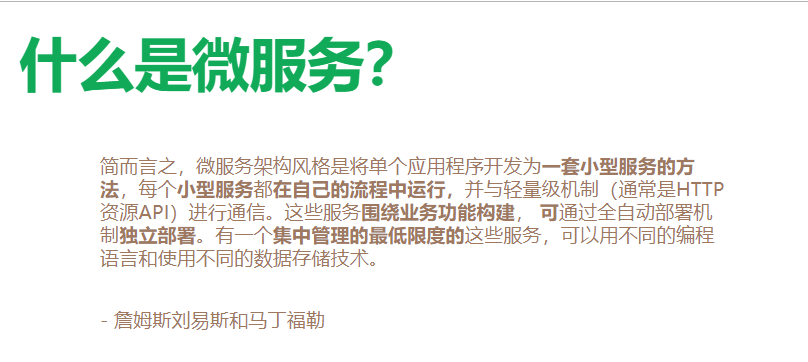
* **开发应用时,一个应用应该是一组小型服务,每一个小型服务运行在自己的进程内,应用之间可以通过Http的方式进行互通**
* 单体应用: **ALL IN ONE**
   * 优点:开发,测试,部署,扩展简单
   * 缺点:修改单个应用,有可能会修改多个模块的功能,当软件需求过多,业务非常复杂,有可能牵一发而动全身

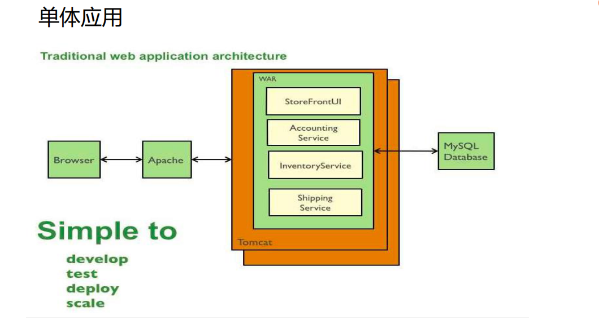

* 微服务


每一个功能元素都是一个可独立替换和独立升级的软件单元

[详细参照Martin Fowler官网](https://martinfowler.com/articles/microservices.html#MicroservicesAndSoa)

[微服务中文网](http://blog.cuicc.com/blog/2015/07/22/microservices/)

微服务神经元

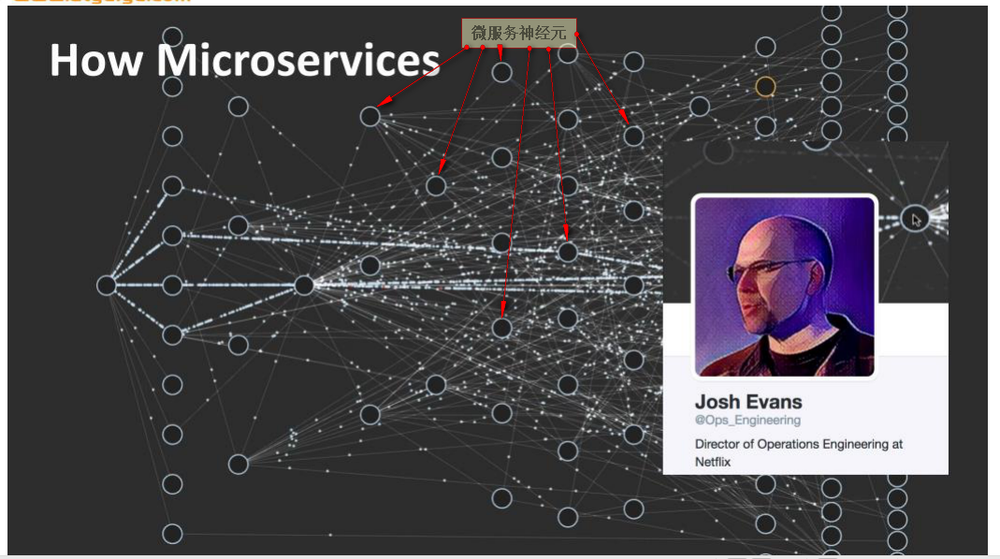

**SpringBoot应用**

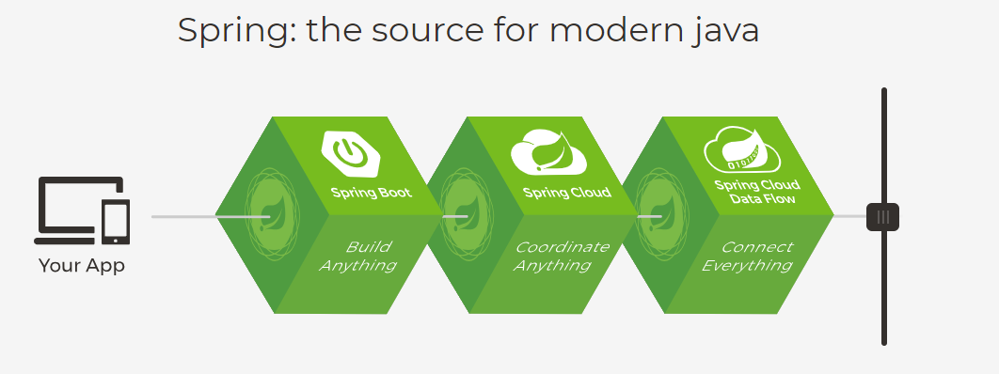

# ***SpringBoot应用开发环境约束***
* JDK1.8:       Spring Boot 推荐jdk1.7及以上
* MAVEN3.X:     MAVEN 3.3 以上版本
* [IDEA使用教程](https://www.imooc.com/learn/924)

# ***SpringBoot应用创建***

## ***1.引入依赖[略]***

## ***2.编写启动类***

```java
/**
 *  @SpringBootApplication: 标注一个主程序类,说明这是一个SpringBoot应用
 */

@SpringBootApplication
public class ListenApplication {
    public static void main(String[] args) {

        // SpringBoot应用启动入口
        SpringApplication.run(ListenApplication.class,args);
    }
}
```

## ***3.编写控制层***

```java
@RestController
@RequestMapping("/listen")
public class ListenController {

    @GetMapping("/listen")
    public String listen(){

        //返回JSON字符串
        return "clown is laughing at you...";
    }
}
```

## ***4.浏览器访问***
[浏览器访问](https://http://localhost:9090/springboot_listen/listen/listen)

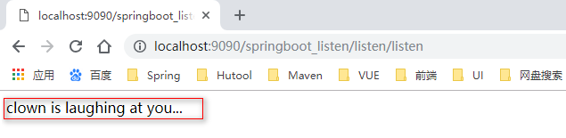

# ***SpringBoot程序分析***

### **POM文件**
```xml
<parent>
    <groupId>org.springframework.boot</groupId>
    <artifactId>spring-boot-starter-parent</artifactId>
    <version>2.1.1.RELEASE</version>
    <relativePath/>
</parent>

[他的父项目是真正管理springboot应用的依赖版本,以后导入其他依赖后,默认不用写该依赖版本号]
[如果没有在dependencies里面管理的依赖自然需要添加版本号]
<parent>
    <groupId>org.springframework.boot</groupId>
    <artifactId>spring-boot-dependencies</artifactId>
    <version>2.1.1.RELEASE</version>
    <relativePath>../../spring-boot-dependencies</relativePath>
</parent>

依赖如下:
<properties>
        <activemq.version>5.15.8</activemq.version>
        <antlr2.version>2.7.7</antlr2.version>
        <appengine-sdk.version>1.9.68</appengine-sdk.version>
        <artemis.version>2.6.3</artemis.version>
        <aspectj.version>1.9.2</aspectj.version>
        <assertj.version>3.11.1</assertj.version>
        <atomikos.version>4.0.6</atomikos.version>
        <bitronix.version>2.1.4</bitronix.version>
        <build-helper-maven-plugin.version>3.0.0</build-helper-maven-plugin.version>
        <byte-buddy.version>1.9.5</byte-buddy.version>
        <caffeine.version>2.6.2</caffeine.version>
        <cassandra-driver.version>3.6.0</cassandra-driver.version>
        <classmate.version>1.4.0</classmate.version>
        <commons-codec.version>1.11</commons-codec.version>
        <commons-dbcp2.version>2.5.0</commons-dbcp2.version>
        <commons-lang3.version>3.8.1</commons-lang3.version>
        <commons-pool.version>1.6</commons-pool.version>
        <commons-pool2.version>2.6.0</commons-pool2.version>
        <couchbase-cache-client.version>2.1.0</couchbase-cache-client.version>
        <couchbase-client.version>2.7.1</couchbase-client.version>
        <derby.version>10.14.2.0</derby.version>
        <dom4j.version>1.6.1</dom4j.version>
        <dropwizard-metrics.version>4.0.3</dropwizard-metrics.version>
        <ehcache.version>2.10.6</ehcache.version>
        <ehcache3.version>3.6.2</ehcache3.version>
        <elasticsearch.version>6.4.3</elasticsearch.version>
        等等...
</properties>
```
### **spring-boot-starter-web**

* spring-boot-starter-web : spring-boot场景启动器,帮我们引入web模块正常运行所依赖的组件

```pom
<dependencies>
    <dependency>
      <groupId>org.springframework.boot</groupId>
      <artifactId>spring-boot-starter</artifactId>
      <version>2.1.1.RELEASE</version>
      <scope>compile</scope>
    </dependency>
    <dependency>
      <!-- json-->
      <groupId>org.springframework.boot</groupId>
      <artifactId>spring-boot-starter-json</artifactId>
      <version>2.1.1.RELEASE</version>
      <scope>compile</scope>
    </dependency>
    <!-- tomcat -->
    <dependency>
      <groupId>org.springframework.boot</groupId>
      <artifactId>spring-boot-starter-tomcat</artifactId>
      <version>2.1.1.RELEASE</version>
      <scope>compile</scope>
    </dependency>
    <!-- hibernate-validator -->
    <dependency>
      <groupId>org.hibernate.validator</groupId>
      <artifactId>hibernate-validator</artifactId>
      <version>6.0.13.Final</version>
      <scope>compile</scope>
    </dependency>
    <!-- spring-web -->
    <dependency>
      <groupId>org.springframework</groupId>
      <artifactId>spring-web</artifactId>
      <version>5.1.3.RELEASE</version>
      <scope>compile</scope>
    </dependency>
    <!-- spring-webmvc -->
    <dependency>
      <groupId>org.springframework</groupId>
      <artifactId>spring-webmvc</artifactId>
      <version>5.1.3.RELEASE</version>
      <scope>compile</scope>
    </dependency>
  </dependencies>
```

SpringBoot将所有场景都抽取出来,做成一个个的starter[***启动器***],开发时只要在项目里面引入这些starter,相关依赖就会自动导入[***用什么导什么***]

[*spring-boot-starter官方启动器列表*](https://docs.spring.io/spring-boot/docs/2.1.1.RELEASE/reference/htmlsingle/#using-boot-starter)

***点击启动器后的POM按钮,查看该启动器导入的依赖***


下为spring-boot-starter-amqp启动器为例

```pom
<?xml version="1.0" encoding="UTF-8"?>
<project xmlns="http://maven.apache.org/POM/4.0.0" xmlns:xsi="http://www.w3.org/2001/XMLSchema-instance"
	xsi:schemaLocation="http://maven.apache.org/POM/4.0.0 http://maven.apache.org/xsd/maven-4.0.0.xsd">
	<modelVersion>4.0.0</modelVersion>
	<parent>
	 <groupId>org.springframework.boot</groupId>
	 <artifactId>spring-boot-starters</artifactId>
	 <version>${revision}</version>
	</parent>
	<artifactId>spring-boot-starter-amqp</artifactId>
	<name>Spring Boot AMQP Starter</name>
	<description>Starter for using Spring AMQP and Rabbit MQ</description>
	<properties>
	    <main.basedir>${basedir}/../../..</main.basedir>
	</properties>
        <dependencies>
         <dependency>
          <groupId>org.springframework.boot</groupId>
          <artifactId>spring-boot-starter</artifactId>
         </dependency>
         <dependency>
          <groupId>org.springframework</groupId>
          <artifactId>spring-messaging</artifactId>
         </dependency>
         <dependency>
          <groupId>org.springframework.amqp</groupId>
          <artifactId>spring-rabbit</artifactId>
         </dependency>
        </dependencies>
</project>
```

# ***SpringBoot启动类分析***

```java
@SpringBootApplication
public class ListenApplication {
    public static void main(String[] args) {

        // SpringBoot应用启动入口
        SpringApplication.run(ListenApplication.class,args);
    }
}
```
**@SpringBootApplication:** Spring Boot应用标注在某个类上说明这个类是SpringBoot的主配置类,SpringBoot就应该运行这个类的main方法来启动SpringBoot应用；

## ***@SpringBootApplication注解解析***
* ***<font color=red size=4>将主配置类(@SpringBootApplication注解标注的类)所在的包及下面所有的子包里面的组件扫描到spring容器中</font>***
```java
@Target(ElementType.TYPE)
@Retention(RetentionPolicy.RUNTIME)
@Documented
@Inherited
@SpringBootConfiguration
@EnableAutoConfiguration
@ComponentScan(excludeFilters = {
		@Filter(type = FilterType.CUSTOM, classes = TypeExcludeFilter.class),
		@Filter(type = FilterType.CUSTOM, classes = AutoConfigurationExcludeFilter.class) })
public @interface SpringBootApplication {
```
* **@SpringBootConfiguration**
   * springboot配置类,这个注解标注在哪一个类上,表示这个类就是springboot的配置类
   * 配置类 ==== 配置文件
   * 配置类也是容器中的组件
* **@EnableAutoConfiguration**
   * @EnableAutoConfiguration注解告诉springboot开启自动配置功能
   * 以前我们配置的东西,现在都不需要配置,springboot自动帮我们配置
       * **@AutoConfigurationPackage**
         * 自动配置包
         * **@Import(AutoConfigurationPackages.Registrar.class)**
            * Spring的底层注解
            * 给容器导入组件,导入的组件由AutoConfigurationPackages.Registrar.class决定
            * 点击Registrar
```java
@Target(ElementType.TYPE)
@Retention(RetentionPolicy.RUNTIME)
@Documented
@Inherited
@AutoConfigurationPackage
@Import(AutoConfigurationImportSelector.class)
public @interface EnableAutoConfiguration {
```


```java
@Target(ElementType.TYPE)
@Retention(RetentionPolicy.RUNTIME)
@Documented
@Inherited
@Import(AutoConfigurationPackages.Registrar.class)
public @interface AutoConfigurationPackage {}
```

```java
/**
 * {@link ImportBeanDefinitionRegistrar} to store the base package from the importing configuration.
 */
static class Registrar implements ImportBeanDefinitionRegistrar, DeterminableImports {
    @Override
    public void registerBeanDefinitions(AnnotationMetadata metadata,
            BeanDefinitionRegistry registry) {
        register(registry, new PackageImport(metadata).getPackageName());
    }
    @Override
    public Set<Object> determineImports(AnnotationMetadata metadata) {
        return Collections.singleton(new PackageImport(metadata));
    }
}
```

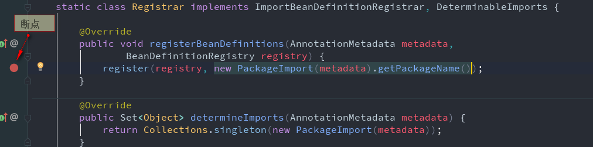

运算结果

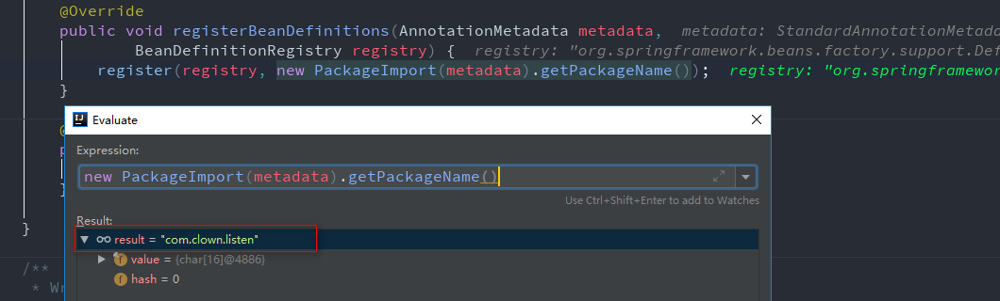

* **@Import(AutoConfigurationImportSelector.class)**
   * 给容器中导入组件,开启自动配置的导包选择器
   * ***将所有需要导入的组件以全类名的方式返回,这些组件就会被添加到容器中***
   * ***<font color=red size=4>最终作用就是给容器中导入非常多的自动配置类(XXXAutoConfiguration),就是给容器导入所有组件并配置好组件基本的参数</font>***
```java
@Override
public String[] selectImports(AnnotationMetadata annotationMetadata) {
    if (!isEnabled(annotationMetadata)) {
        return NO_IMPORTS;
    }
    AutoConfigurationMetadata autoConfigurationMetadata = AutoConfigurationMetadataLoader
            .loadMetadata(this.beanClassLoader);
    AutoConfigurationEntry autoConfigurationEntry = getAutoConfigurationEntry(
            autoConfigurationMetadata, annotationMetadata);
    return StringUtils.toStringArray(autoConfigurationEntry.getConfigurations());
}
```

断点

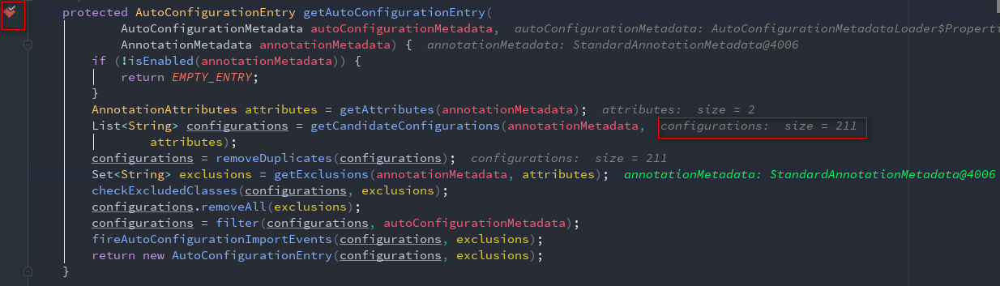

结果

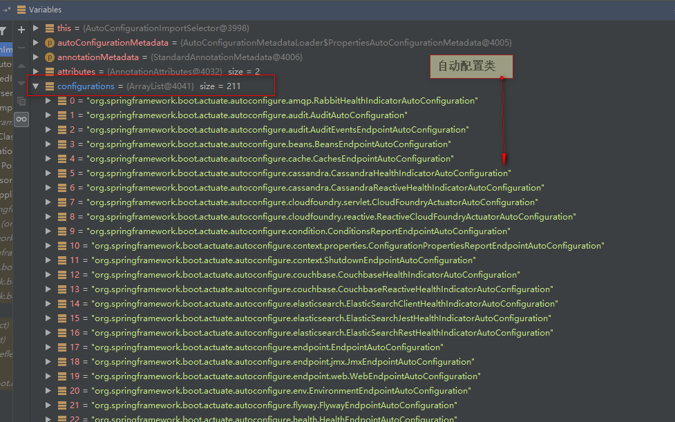

* ***<font color=red size=5>有了自动配置类,免去我们手动编写配置注入功能等工作</font>***

* 主要使用的方法
   * **List<String> configurations = SpringFactoriesLoader.loadFactoryNames(
       				getSpringFactoriesLoaderFactoryClass(), getBeanClassLoader());**

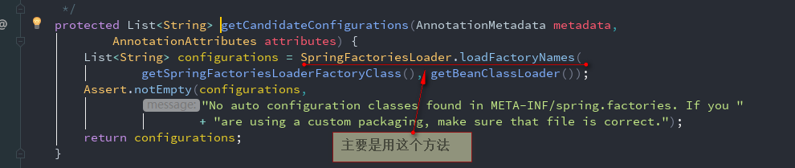

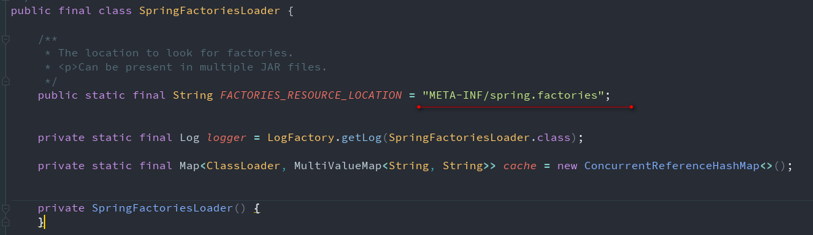

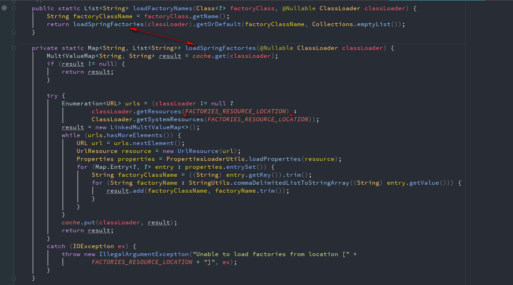

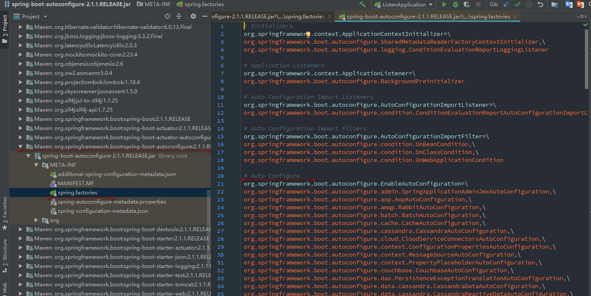

* ***<font color=red size=5>Springboot启动的时候从类路径下的 MATE-INF/spring.factories中获取EnableAutoConfiguration指定的值
将这些值作为自动配置类导入到容器中,自动配置类生效了,帮我们进行自动配置</font>***

以webmvcAutoconfiguration为例

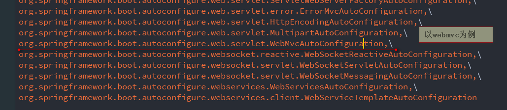


* ***<font color=red size=5>以前需要我们自己配置的东西,自动配置类已经给我们做好了</font>***

* ***默认的自动配置全在org\springframework\boot\spring-boot-autoconfigure\2.1.1.RELEASE\spring-boot-autoconfigure-2.1.1.RELEASE.jar***

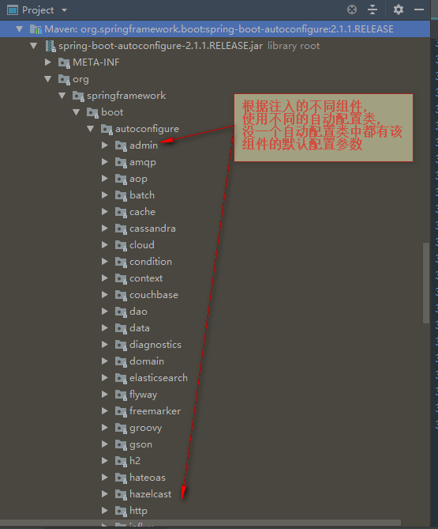

# ***<font color=red>J2EE一揽子解决方案</font>***

#***SpringBoot工程结构***
   * src
      * main
         * java
         * resources
            * static: 保存静态资源[js,css,image]
            * templates:保存所有的模板页面[SpringBoot默认使用嵌入式的Tomcat,默认不支持JSP页面,可以使用Thymeleaf模板引擎]
            * Springboot为什么不能使用JSP:
               * 使用Jetty和Tomcat，如果使用war包装可以工作,jar包不支持JSP
               * Undertow不支持JSP
               * 创建自定义error.jsp页面不会覆盖错误处理的默认视图
               * [详见Spring官网](https://docs.spring.io/spring-boot/docs/2.1.1.RELEASE/reference/htmlsingle/#boot-features-jsp-limitations)
            * application.yml(bootstrap.yml):springboot应用的配置文件,不使用默认配置,自定义配置信息
      * test


