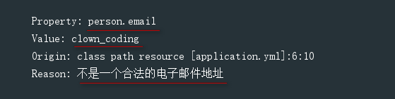
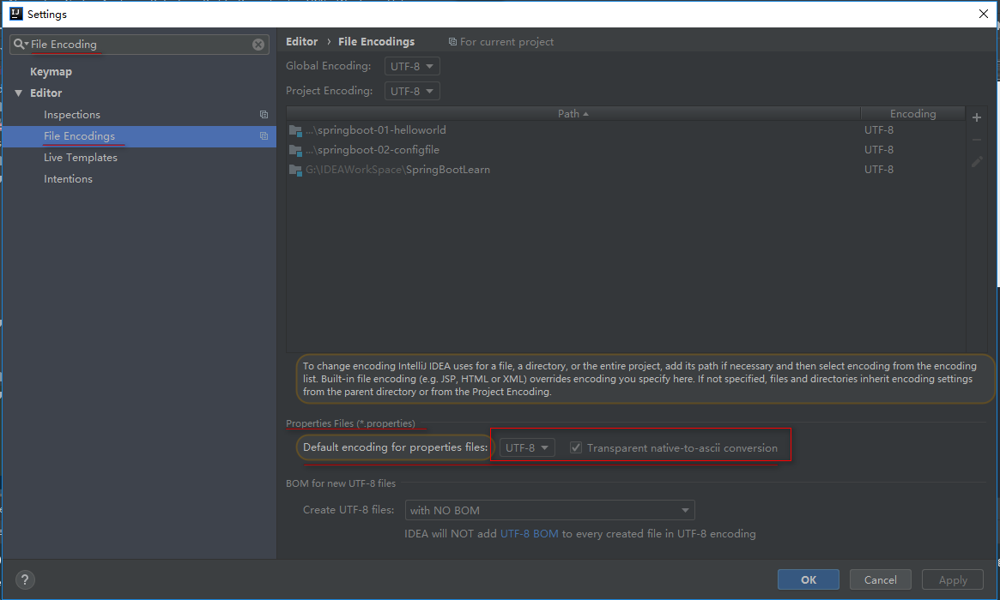
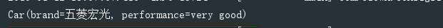

# ***SpringBoot全局配置文件***

### ***SpringBoot配置文件***
* SpringBoot默认使用一个全局配置文件,文件名固定,只能使用application
* 配置文件类型
   * application.properties
   * application.yml
* 配置文件作用:**<font color=00FFFF size=5>修改SpringBoot的默认配置,当我们使用自己的自定义配置时,直接在配置文件中修改</font>**
* 配置文件位置:配置文件放在<font color=red size=5>src/main/resources</font>目录或<font color=red size=5>类路径/config下</fony>
### ***YML文件***
* yml是YAML(YAML Aint`t Markup Language)语言的文件,以**数据为中心**,比json,xml更适合做配置文件
   * [YML语法参考规范](http://www.yaml.org)
### **YAML与properties文件配置对比**
* yml文件
   ```yaml
   server:
     port: 9090
   ```
* properties文件
   ```properties
   server.port=9090
   ```
### **YAML文件语法**
* **YAML基本语法**
   * 使用缩进表示层级关系
   * 缩进不允许使用Tab键,只允许是用空格
   * 缩进的空格数目不重要,只要相同层级的元素左对齐即可
   * 大小写敏感
   * 举例:
   ```yaml
   server:
     port: 15003
     servlet:
       context-path: /springboot-mybatis
   spring:
     application:
       name: springboot-mybatis
     datasource:
       driver-class-name: com.mysql.cj.jdbc.Driver
       url: jdbc:mysql://localhost:3306/clown?useUnicode=true&characterEncoding=utf8&serverTimezone=GMT%2B8&useSSL=false
       username: root
       password: "123456"
   #以下设置为当程序启动后,会自动在数据库建立表 initialization-mode: always
       schema-username: root
       schema-password: '123456'
       data-username: root
       data-password: '123456'
       schema:
          - classpath:sql/department.sql
          - classpath:sql/employee.sql
       initialization-mode: never
       type: com.alibaba.druid.pool.DruidDataSource
       #   数据源其他配置
       initialSize: 5          #数据库连接池初始化连接个数
       minIdle: 5
       maxActive: 20
       maxWait: 60000
       timeBetweenEvictionRunsMillis: 60000
       minEvictableIdleTimeMillis: 300000
       validationQuery: SELECT 1 FROM DUAL
       testWhileIdle: true
       testOnBorrow: false
       testOnReturn: false
       poolPreparedStatements: true
       #   配置监控统计拦截的filters，去掉后监控界面sql无法统计，'wall'用于防火墙
       filters:
         - stat
         - wall
         - log4j
       maxPoolPreparedStatementPerConnectionSize: 20
       useGlobalDataSourceStat: true
       connectionProperties: druid.stat.mergeSql=true;druid.stat.slowSqlMillis=500

   #mybatis配置
   mybatis:
     mapper-locations: classpath:mybatis/mapper/*.xml
     configuration:
       map-underscore-to-camel-case: true
     #cnfig-location: classpath:mybatis/mybatis-config.xml.bak     #此配置是为了在核心配置文件中开启驼峰命名规则

   #打印sql语句
   logging:
     level:
       com.clown.mybatis.mapper: debug
    ```
* **YAML支持的三种数据结构**
   * 字面量:普通的值(数字,字符串,布尔)
      * k:v
          * 字面值直接写就行
          * 字符串默认不用+单双引号
             * 双引号:不会转义字符串里的特殊字符,特殊字符会最为本身想表示的意思
             ```yam
             值:name:"张三 \n 李四"
             输出: 张三
                  李四
              会将换行符输出
              ```
              * 单引号:会转义特殊字符,特殊字符最终就是一个字符串输出
              ```yml
              值:name:'张三 \n 李四'
              输出:张三 \n 李四
              ```
   * 对象/map:键值对的集合(k:v)
      * 对象还是K:V
      * 在下一行写对象的属性和值 <font color=red size = 5>不要忘记空格</font>
      * 举例:person
         * 第一种写法
         ```yaml
         person:
                 name: 张3
                 age: 12
                 address: 内蒙古赤峰市
                 word: clown is laughing at you
         ```
         * 第二种写法[行内写法]
         ```yaml
         person: {name: 张3,age: 12,address: 内蒙古赤峰市,word: clown is laughing at you}
         ```
   * 数组:一组按次序排列的值(List,Set)
      * 用 -空格值 表示数组的一个元素
      * 举例: person
         * 第一种写法
         ```yaml
         person:
             - Chinese
             - Japanese
             - American
         ```
         * 第二种写法[行内写法]
         ```yaml
         person: [Chinese,Japanese,American]
         ```
         ```yaml
         person: Chinese,Japanese,American
         ```
### **读取YAML文件自定义参数**
* 1.引入依赖
```yaml
<!-- processor: 配置文件处理器,配置文件进行绑定就会有提示 -->
<dependencies>
    <dependency>
        <groupId>org.springframework.boot</groupId>
        <artifactId>spring-boot-configuration-processor</artifactId>
        <optional>true</optional>
    </dependency>
</dependencies>
```
* 2.YAML文件创建参数
```yaml
person:
  name: 张3
  age: 12
  boss: false
  birthday: 1993/10/20
  map:
    k1: v1
    k2: v2
  list:
    - 李4
    - 王5
  dog:
    name: 旺财
    age: 12
```
* 3.创建实体类
   * 3.1 Person
   ```java
   /**
    * @ConfigurationProperties: 告诉SpringBoot将本类中的所有属性值和配置文件中的相关配置进行绑定
    *      prefix = "person" : 配置文件中哪个所有的属性进行--映射
    * [注意]: 只有这个组件是容器中的组件,才能使用 + @Component注解
    */
   @Data
   @Component
   @ConfigurationProperties(prefix = "person")
   public class Person {

       private String name;

       private Integer age;

       private Boolean boss;

       private Date birthday;

       private Map<String,Object> map;

       private List<Object> list;

       private Dog dog;
   }
   ```
   * 3.2 Dog
   ```java
   @Data
   public class Dog {

       private String name;

       private Integer age;
   }
   ```
* 4.创建测试类
```java
@RunWith(SpringJUnit4ClassRunner.class)
@SpringBootTest
public class PersonTest {

    @Autowired
    Person person;

    @Test
    public void personTest(){
        System.out.println(person);
    }
}
```
* 5.console打印结果


* 6.YAML文件支持松散语法绑定
* 7.JSR303数据校验
   * 实体类添加注解
   ```java
   @Data
   @Component
   @ConfigurationProperties(prefix = "person")
   @Validated              //JSR303数据校验
   public class Person {

       private String name;

       private Integer age;

       private Boolean boss;

       private Date birthday;

       @Email
       private String email;

       private Map<String,Object> map;

       private List<Object> list;

       private Dog dog;
   }
   ```
   * yml文件添加属性
   ```yaml
   person:
     name: 张3
     age: 12
     boss: false
     birthday: 1993/10/20
     email: clown_coding@163.com
     map:
       k1: v1
       k2: v2
     list:
       - 李4
       - 王5
     dog:
       name: 旺财
       age: 12
    ```
    * console打印

    

    * 如果邮箱不是正确的格式
       * 将邮箱值修改为clown_coding
       * console打印结果

       
### **读取Properties文件自定义参数**
* 1.引入依赖[略]
* 2.Properties文件创建参数
```properties
person.name=张3
person.age=12
person.birthday=1993/10/20
person.boss=false
person.map.k1=v1
person.map.k2=v2
person.list[0]=李4
person.list[1]=王5       #person.list=李4,王5 集合可以使用这种写法
person.dog.name=旺财
person.dog.age=12
```
* 3.创建实体类[略]
* 4.创建测试类[略]
* 5.console打印结果


* 6.<font color=red>注意:如果控制台显示乱码,进行如下设置</font>
   * Ctrl+Alt+s
   * 搜索:File Encodings
   * 将properties文件编码设置为UTF-8
   * 

### **使用@Value注解进行读取**
* 1.引入依赖[略]
* 2.创建YAML/Properties文件创建参数[略]
* 3.创建实体类进行映射
```java
@Data
@Component
public class Person {

    @Value("${person.name}")
    private String name;

    @Value("#{11*2}")  //SpEL表达式
    private Integer age;

    @Value("true")
    private Boolean boss;

    @Value("${person.birthday}")
    private Date birthday;

    private Map<String,Object> map;

    private List<Object> list;

    private Dog dog;
}
```
* 4.创建测试类[略]
* 5.console打印结果


* 6.Properties文件比支持松散语法绑定,单支持SpEL表达式

### **以上读取自定义配置文件参数对比**


|| @ConfigurationProperties |@Value|
|---|---|---|
|功能| 批量注入配置文件中的参数 |一个一个指定|
|松散绑定| 支持 |不支持|
|松散绑定| 支持 |不支持|
|SpEL| 不支持 |支持|
|JSR303数据校验| 支持 |不支持|
|复杂类型封装| 支持 |不支持|

<font color =red size = 6>配置文件yml还是properties都能获取到值</font>
<font color =red size = 6>如果只是获取配置文件中的某一项值,@Value注解最适合</font>
<font color =red size = 6>如果专门编写了JavaBean来和配置文件映射,@ConfigurationProperties注解最适合</font>
## **SpringBoot2.X新的读取方式**
* 1.引入依赖[略]
* 2.创建YAML/Properties文件创建参数
```yaml
person:
  name: 张3
  age: 12
  boss: false
  birthday: 1993/10/20
  email: clown_coding@163.com
  map:
    k1: v1
    k2: v2
  list:
    - 李4
    - 王5
  dog:
    name: 旺财
    age: 12
people:
  name: 王二麻子
  list:
    - Chinese
    - Japanese
    - American
```
* 3.创建实体类进行映射
```java
@Data
@ConfigurationProperties(prefix = "people")
public class People {

    private String name;

    private List<Object> list;
}
```
* 4.启动类中进行绑定
```java
@SpringBootApplication
public class ConfigFileApplication {
    public static void main(String[] args){
        //SpringApplication.run(ConfigFileApplication.class,args);
        ApplicationContext applicationContext = SpringApplication.run(ConfigFileApplication.class, args);
        Binder binder = Binder.get(applicationContext.getEnvironment());
        People people = binder.bind("people", Bindable.of(People.class)).get();
        System.out.println(people);
    }
}
```
* 5.运行程序,console打印结果如下


## **@PropertySources&@ImportResource**
* <font color=red size=6>@PropertySources</font>
   * <font color=#00FFFF size=6>作用: 加载指定的配置文件,只能使用在properties文件中</font>
   * 1.创建car.properties文件
   ```properties
   car.brand=五菱宏光
   car.performance=very good
   ```
   * 2.创建car的实体类
   ```java
   @Data
   @Component
   @PropertySource(value = {"classpath:car.properties"})
   @ConfigurationProperties(prefix = "car")
   public class Car {

       private String brand;

       private String performance;
   }
   ```
   * 3.创建测试类
   ```java
   @RunWith(SpringJUnit4ClassRunner.class)
   @SpringBootTest
   public class CarTest {

       @Autowired
       Car car;

       @Test
       public void carTest(){
           System.out.println(car);
       }
   }
   ```
   * 4.console打印结果

   
* <font color=red size=6>@ImportResource</font>
   * <font color=#00FFFF size=6>作用: 导入Spring的配置文件,让配置文件里的内容生效</font>
   * 1.创建实体类
   ```java
   public class HelloService {}
   ```
   * 2.创建Spring的配置文件
   ```xml
   <?xml version="1.0" encoding="UTF-8"?>
   <beans xmlns="http://www.springframework.org/schema/beans"
          xmlns:xsi="http://www.w3.org/2001/XMLSchema-instance"
          xsi:schemaLocation="http://www.springframework.org/schema/beans http://www.springframework.org/schema/beans/spring-beans.xsd">
       <bean id="helloService" class="com.clown.configfile.service.HelloService"></bean>
   </beans>
   ```
   * 3.在启动类中添加@ImportResource注解
   ```java
   @ImportResource(locations = {"classpath:beans.xml"})
   @SpringBootApplication
   public class ConfigFileApplication {
       public static void main(String[] args){
           SpringApplication.run(ConfigFileApplication.class,args);
       }
   }
   ```
   * 4.编写测试类
   ```java
   @RunWith(SpringJUnit4ClassRunner.class)
   @SpringBootTest
   public class HelloServiceTest {

       @Autowired
       ApplicationContext applicationContext;

       @Test
       public void test(){
           boolean flag = applicationContext.containsBean("helloService");
           if (flag) {
               System.out.println("存在");
               return;
           }
           System.out.println("不存在");
       }
   }
   ```
   * 5.console打印结果

   
* <font color=red size=6>实际开发不适用@ImportResource这种方式,SpringBoot推荐使用全注解的方式</font>
   * 第一种方式
      * 1.创建一个配置类MyAppConfig
         * 配置类 ==== 配置文件
         ```java
         @Configuration
         public class MyAppConfig {

             //将方法的返回值添加到容器中,默认id就是方法名
             @Bean
             public HelloService helloServiceConfig(){
                 return new HelloService();
             }
         }
         ```
      * 2.执行测试
      ```java
      @Test
          public void myAppConfigTest(){
              boolean flag = applicationContext.containsBean("helloServiceConfig");
              if (flag) {
                  System.out.println("存在");
                  return;
              }
              System.out.println("不存在");

          }
       ```
       * 3.结果存在
   * 第二种方式
      * 直接在启动类中注入
      ```java
      @SpringBootApplication
      public class ConfigFileApplication {
          public static void main(String[] args){
              SpringApplication.run(ConfigFileApplication.class,args);

          }

          @Bean
          public HelloService helloServiceConfigBoot(){
              return new HelloService();
          }
      }
      ```
      * 执行测试存在
      ```java
      @Test
          public void helloServiceConfigBoot(){
              boolean flag = applicationContext.containsBean("helloServiceConfigBoot");
              if (flag) {
                  System.out.println("存在");
                  return;
              }
              System.out.println("不存在");
          }
      ```
## **配置文件占位符**
* <font color=red size=6>**随机数**</font>
   * 1.创建YMAL文件,添加自定义参数
   ```ymal
   person:
     name: 张3
     age: 12
     boss: false
     birthday: 1993/10/20
     email: clown_coding@163.com
     map:
       k1: v1
       k2: v2
     list:
       - 李4
       - 王5
     dog:
       name: 旺财
       age: 12
   people:
     name: 王二麻子
     list:
       - Chinese
       - Japanese
       - American
   student:
     id: ${random.uuid}
     name: 铁蛋
     age: ${random.int}
     grade: ${grade.name:蓝翔挖掘机大学三年二班}
     dog:
       name: ${student.name}
       age: ${random.int(10)}
    ```
    * 2.创建实体类
    ```java
    @Data
    @Component
    @ConfigurationProperties(prefix = "student")
    public class Student {

        private String id;
        private String name;
        private Integer age;
        private String grade;
        private Dog dog;
    }
   ```
   * 3.创建测试
   ```java
   @RunWith(SpringJUnit4ClassRunner.class)
   @SpringBootTest
   public class StudentTest {

       @Autowired
       Student student;

       @Test
       public void studentTest(){
           System.out.println(student);
       }
   }
   ```
   * 4.console打印结果

   
* <font color=red size=6>**占位符**</font>
   * 占位符可以获取之前配置的值,如果没有可以使用冒号使用默认的值
   * **grade: ${grade.name:蓝翔挖掘机大学三年二班}**

# ***以上为SpringBoot全局配置文件的操作***
