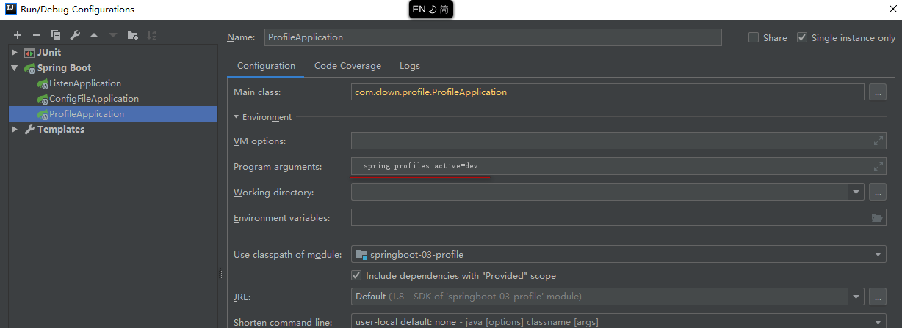
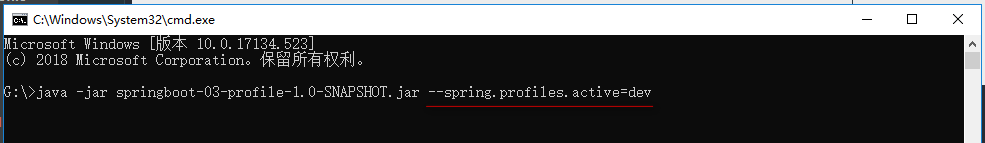
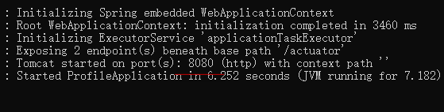
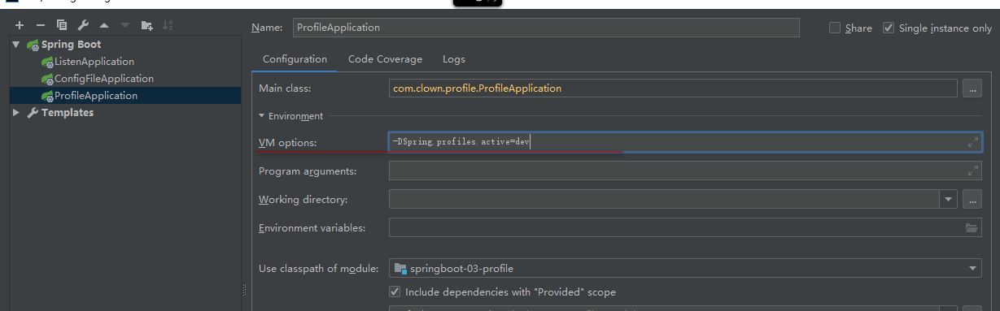

# ***SpringBoot-Profile***

## **Profile功能**
* <font color=#00FFFF size=6>Profile是Spring对不同环境提供不同的配置功能的支持,可以通过激活指定参数等方式快速切换环境</font>
### **1.多Profile文件**
* 我们在主配置文件编写的时候,文件名可以是application-{profile}.yml/properties
* 1.创建3个yml配置文件
   * application.yml: 主配置文件
   ```yaml
   spring:
     profiles:
       active: dev
    ```
   * application-dev.yml: 开发环境配置文件
   ```yaml
   server:
     port: 8080
   ```
   * application-prod.yml: 生产环境配置文件
   ```yaml
   server:
     port: 9090
   ```
* 2.启动应用console打印


* 3.将application.yml中的参数进行修改
```yaml
spring:
     profiles:
       active: prod
```
* 4.启动应用console打印


### **2.YAML文件多文档块**
* 1.配置application.yml文件
```yaml
spring:
  profiles:
    active: prod
---

server:
  port: 8080
spring:
  profiles: dev

---

server:
  port: 9090
spring:
  profiles: prod
```
* 2.启动应用console打印


* 3.进行切换
```yaml
spring:
  profiles:
    active: dev
---

server:
  port: 8080
spring:
  profiles: dev

---

server:
  port: 9090
spring:
  profiles: prod
```
* 4.启动应用console打印


### **3.命令行方式激活**
```java
--spring.profile.active=dev
```


* 1.启动应用console打印


### **4.部署时激活**
* 将当前应用打为jar包
* cmd输入以下命令



* 启动应用console打印



### **5.虚拟机参数激活**
* 填写参数



* 启动应用console打印


# ***SpringBoot配置文件加载位置***

* springboot启动后会默认从以下位置加载全局配置文件,application.yml作为默认的配置文件
   * <font color=red size=6>springboot-03-profile/config/application.properties</font>
   * <font color=red size=6>springboot-03-profile/application.properties</font>
   * 上面两种没试过
   * <font color=red size=6>resources/config/</font>
   * <font color=red size=6>resources/</font>
* **以上为优先级为<font color=red size=6>由高到低</font>排列,所有位置的文件都会被加载,高优先级覆盖低优先级内容**
* 也可已通过spring.config.locaion来改变默认配置
   * 当项目打包好后,使用命令行参数启动项目,启动的时候来制定配置稳健的位置
   * 注意只能使用properties文件
   * 执行命令

   
   * 显示结果

   

# ***SpringBoot外部文件加载顺序***

**SpringBoot也可以从以下位置加载配置； 优先级从高到低；高优先级的配置覆盖低优先级的配置，所有的配置会形成互补配置**

1.命令行参数

所有的配置都可以在命令行上进行指定

java -jar spring-boot-02-config-02-0.0.1-SNAPSHOT.jar --server.port=8087  --server.context-path=/abc

多个配置用空格分开； --配置项=值

2.来自java:comp/env的JNDI属性

3.Java系统属性（System.getProperties()）

4.操作系统环境变量

5.RandomValuePropertySource配置的random.*属性值
==由jar包外向jar包内进行寻找；==
==优先加载带profile==

6.jar包外部的application-{profile}.properties或application.yml(带spring.profile)配置文件

7.jar包内部的application-{profile}.properties或application.yml(带spring.profile)配置文件
==再来加载不带profile==

8.jar包外部的application.properties或application.yml(不带spring.profile)配置文件

9.jar包内部的application.properties或application.yml(不带spring.profile)配置文件

10.@Configuration注解类上的@PropertySource

11.通过SpringApplication.setDefaultProperties指定的默认属性

* [官方文档配置参数](https://docs.spring.io/spring-boot/docs/2.1.2.RELEASE/reference/htmlsingle/#boot-features-external-config)


