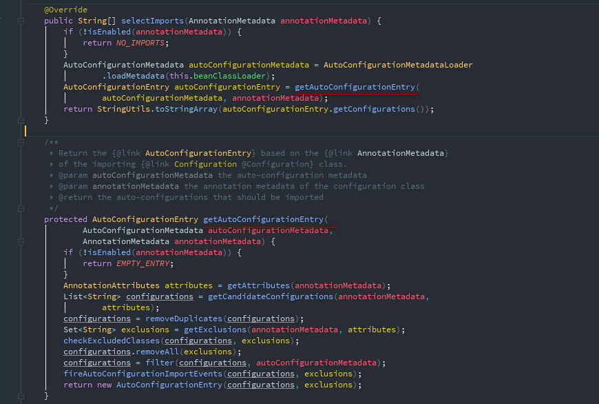
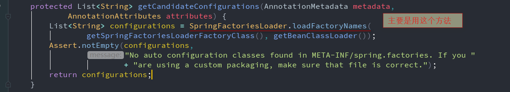
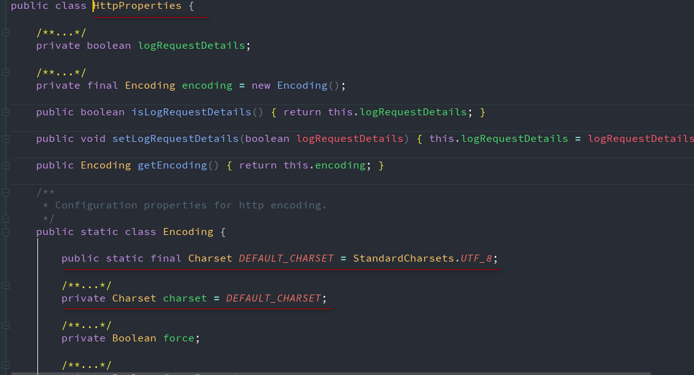
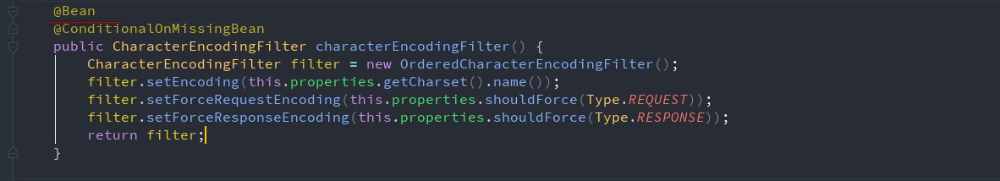
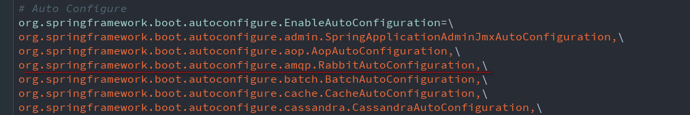
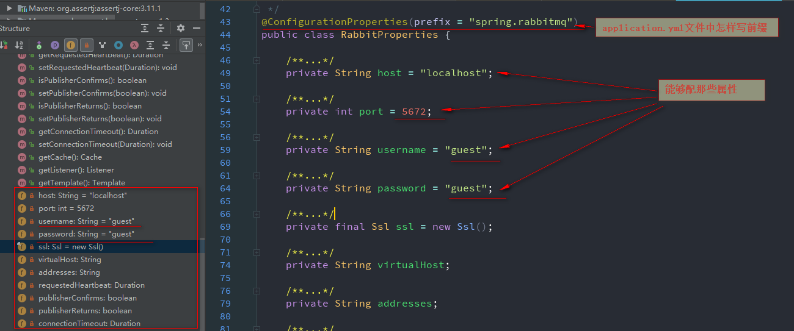

# ***SpringBoot自动配置原理***

<font color=green size=6> [SpringBoot可配置参数列表](https://docs.spring.io/spring-boot/docs/2.0.8.RELEASE/reference/htmlsingle/#common-application-properties)</font>

## **SpringBoot自动配置原理**
1. SpringBoot启动的时候,加载主配置类,开启自动配置功能 <font color=#9932CC>@EnableAutoConfiguration</font>
2. <font color=#9932CC>@EnableAutoConfiguration</font>作用:
   * 利用<font color=#9932CC>AutoConfigurationImportSelector.class</font>给容器导入一些组件
   * 可以查看以下方法

    
   * 下面的方法就是获取候选的配置
      * ```java
        List<String> configurations = getCandidateConfigurations(annotationMetadata,attributes);
        ```
   * 进入此方法查看

    

   * 进入下面的方法查看
    ```java
     List<String> configurations = SpringFactoriesLoader.loadFactoryNames(getSpringFactoriesLoaderFactoryClass(), getBeanClassLoader());
     作用：扫描所有jar包路径下的 META-INF/spring.factories
          把扫描到的META-INF/spring.factories中的元素封装到一个Enumeration<URL> urls集合中
          再将Enumeration<URL> urls结合进行遍历取出每一个元素,封装到properties对象中
          再从properties对象中获取到EnableAutoConfiguration.class类(类名)对应的值,然后把他们添加在容器中
     ```
     <font color=red size=6>将类路径下的org.springframework.boot.autoconfigure这个jar包下的META-INF文件夹下的spring.factories里面配置的所有EnableAutoConfiguration的值加入到spring容器中</font>
     <font color=red size=6>每一个这样的类XXXAutoConfiguration类都是容器中的一个组件,都加入到容器中,用他们来做自动配置</font>
     ```properties
     # Auto Configure
     org.springframework.boot.autoconfigure.EnableAutoConfiguration=\
     org.springframework.boot.autoconfigure.admin.SpringApplicationAdminJmxAutoConfiguration,\
     org.springframework.boot.autoconfigure.aop.AopAutoConfiguration,\
     org.springframework.boot.autoconfigure.amqp.RabbitAutoConfiguration,\
     org.springframework.boot.autoconfigure.batch.BatchAutoConfiguration,\
     org.springframework.boot.autoconfigure.cache.CacheAutoConfiguration,\
     org.springframework.boot.autoconfigure.cassandra.CassandraAutoConfiguration,\
     org.springframework.boot.autoconfigure.cloud.CloudAutoConfiguration,\
     org.springframework.boot.autoconfigure.context.ConfigurationPropertiesAutoConfiguration,\
     org.springframework.boot.autoconfigure.context.MessageSourceAutoConfiguration,\
     org.springframework.boot.autoconfigure.context.PropertyPlaceholderAutoConfiguration,\
     org.springframework.boot.autoconfigure.couchbase.CouchbaseAutoConfiguration,\
     org.springframework.boot.autoconfigure.dao.PersistenceExceptionTranslationAutoConfiguration,\
     org.springframework.boot.autoconfigure.data.cassandra.CassandraDataAutoConfiguration,\
     org.springframework.boot.autoconfigure.data.cassandra.CassandraReactiveDataAutoConfiguration,\
     org.springframework.boot.autoconfigure.data.cassandra.CassandraReactiveRepositoriesAutoConfiguration,\
     org.springframework.boot.autoconfigure.data.cassandra.CassandraRepositoriesAutoConfiguration,\
     org.springframework.boot.autoconfigure.data.couchbase.CouchbaseDataAutoConfiguration,\
     org.springframework.boot.autoconfigure.data.couchbase.CouchbaseReactiveDataAutoConfiguration,\
     org.springframework.boot.autoconfigure.data.couchbase.CouchbaseReactiveRepositoriesAutoConfiguration,\
     org.springframework.boot.autoconfigure.data.couchbase.CouchbaseRepositoriesAutoConfiguration,\
     org.springframework.boot.autoconfigure.data.elasticsearch.ElasticsearchAutoConfiguration,\
     org.springframework.boot.autoconfigure.data.elasticsearch.ElasticsearchDataAutoConfiguration,\
     org.springframework.boot.autoconfigure.data.elasticsearch.ElasticsearchRepositoriesAutoConfiguration,\
     org.springframework.boot.autoconfigure.data.jpa.JpaRepositoriesAutoConfiguration,\
     org.springframework.boot.autoconfigure.data.ldap.LdapDataAutoConfiguration,\
     org.springframework.boot.autoconfigure.data.ldap.LdapRepositoriesAutoConfiguration,\
     org.springframework.boot.autoconfigure.data.mongo.MongoDataAutoConfiguration,\
     org.springframework.boot.autoconfigure.data.mongo.MongoReactiveDataAutoConfiguration,\
     org.springframework.boot.autoconfigure.data.mongo.MongoReactiveRepositoriesAutoConfiguration,\
     org.springframework.boot.autoconfigure.data.mongo.MongoRepositoriesAutoConfiguration,\
     org.springframework.boot.autoconfigure.data.neo4j.Neo4jDataAutoConfiguration,\
     org.springframework.boot.autoconfigure.data.neo4j.Neo4jRepositoriesAutoConfiguration,\
     org.springframework.boot.autoconfigure.data.solr.SolrRepositoriesAutoConfiguration,\
     org.springframework.boot.autoconfigure.data.redis.RedisAutoConfiguration,\
     org.springframework.boot.autoconfigure.data.redis.RedisReactiveAutoConfiguration,\
     org.springframework.boot.autoconfigure.data.redis.RedisRepositoriesAutoConfiguration,\
     org.springframework.boot.autoconfigure.data.rest.RepositoryRestMvcAutoConfiguration,\
     org.springframework.boot.autoconfigure.data.web.SpringDataWebAutoConfiguration,\
     org.springframework.boot.autoconfigure.elasticsearch.jest.JestAutoConfiguration,\
     org.springframework.boot.autoconfigure.flyway.FlywayAutoConfiguration,\
     org.springframework.boot.autoconfigure.freemarker.FreeMarkerAutoConfiguration,\
     org.springframework.boot.autoconfigure.gson.GsonAutoConfiguration,\
     org.springframework.boot.autoconfigure.h2.H2ConsoleAutoConfiguration,\
     org.springframework.boot.autoconfigure.hateoas.HypermediaAutoConfiguration,\
     org.springframework.boot.autoconfigure.hazelcast.HazelcastAutoConfiguration,\
     org.springframework.boot.autoconfigure.hazelcast.HazelcastJpaDependencyAutoConfiguration,\
     org.springframework.boot.autoconfigure.http.HttpMessageConvertersAutoConfiguration,\
     org.springframework.boot.autoconfigure.http.codec.CodecsAutoConfiguration,\
     org.springframework.boot.autoconfigure.influx.InfluxDbAutoConfiguration,\
     org.springframework.boot.autoconfigure.info.ProjectInfoAutoConfiguration,\
     org.springframework.boot.autoconfigure.integration.IntegrationAutoConfiguration,\
     org.springframework.boot.autoconfigure.jackson.JacksonAutoConfiguration,\
     org.springframework.boot.autoconfigure.jdbc.DataSourceAutoConfiguration,\
     org.springframework.boot.autoconfigure.jdbc.JdbcTemplateAutoConfiguration,\
     org.springframework.boot.autoconfigure.jdbc.JndiDataSourceAutoConfiguration,\
     org.springframework.boot.autoconfigure.jdbc.XADataSourceAutoConfiguration,\
     org.springframework.boot.autoconfigure.jdbc.DataSourceTransactionManagerAutoConfiguration,\
     org.springframework.boot.autoconfigure.jms.JmsAutoConfiguration,\
     org.springframework.boot.autoconfigure.jmx.JmxAutoConfiguration,\
     org.springframework.boot.autoconfigure.jms.JndiConnectionFactoryAutoConfiguration,\
     org.springframework.boot.autoconfigure.jms.activemq.ActiveMQAutoConfiguration,\
     org.springframework.boot.autoconfigure.jms.artemis.ArtemisAutoConfiguration,\
     org.springframework.boot.autoconfigure.groovy.template.GroovyTemplateAutoConfiguration,\
     org.springframework.boot.autoconfigure.jersey.JerseyAutoConfiguration,\
     org.springframework.boot.autoconfigure.jooq.JooqAutoConfiguration,\
     org.springframework.boot.autoconfigure.jsonb.JsonbAutoConfiguration,\
     org.springframework.boot.autoconfigure.kafka.KafkaAutoConfiguration,\
     org.springframework.boot.autoconfigure.ldap.embedded.EmbeddedLdapAutoConfiguration,\
     org.springframework.boot.autoconfigure.ldap.LdapAutoConfiguration,\
     org.springframework.boot.autoconfigure.liquibase.LiquibaseAutoConfiguration,\
     org.springframework.boot.autoconfigure.mail.MailSenderAutoConfiguration,\
     org.springframework.boot.autoconfigure.mail.MailSenderValidatorAutoConfiguration,\
     org.springframework.boot.autoconfigure.mongo.embedded.EmbeddedMongoAutoConfiguration,\
     org.springframework.boot.autoconfigure.mongo.MongoAutoConfiguration,\
     org.springframework.boot.autoconfigure.mongo.MongoReactiveAutoConfiguration,\
     org.springframework.boot.autoconfigure.mustache.MustacheAutoConfiguration,\
     org.springframework.boot.autoconfigure.orm.jpa.HibernateJpaAutoConfiguration,\
     org.springframework.boot.autoconfigure.quartz.QuartzAutoConfiguration,\
     org.springframework.boot.autoconfigure.reactor.core.ReactorCoreAutoConfiguration,\
     org.springframework.boot.autoconfigure.security.servlet.SecurityAutoConfiguration,\
     org.springframework.boot.autoconfigure.security.servlet.SecurityRequestMatcherProviderAutoConfiguration,\
     org.springframework.boot.autoconfigure.security.servlet.UserDetailsServiceAutoConfiguration,\
     org.springframework.boot.autoconfigure.security.servlet.SecurityFilterAutoConfiguration,\
     org.springframework.boot.autoconfigure.security.reactive.ReactiveSecurityAutoConfiguration,\
     org.springframework.boot.autoconfigure.security.reactive.ReactiveUserDetailsServiceAutoConfiguration,\
     org.springframework.boot.autoconfigure.sendgrid.SendGridAutoConfiguration,\
     org.springframework.boot.autoconfigure.session.SessionAutoConfiguration,\
     org.springframework.boot.autoconfigure.security.oauth2.client.OAuth2ClientAutoConfiguration,\
     org.springframework.boot.autoconfigure.solr.SolrAutoConfiguration,\
     org.springframework.boot.autoconfigure.thymeleaf.ThymeleafAutoConfiguration,\
     org.springframework.boot.autoconfigure.transaction.TransactionAutoConfiguration,\
     org.springframework.boot.autoconfigure.transaction.jta.JtaAutoConfiguration,\
     org.springframework.boot.autoconfigure.validation.ValidationAutoConfiguration,\
     org.springframework.boot.autoconfigure.web.client.RestTemplateAutoConfiguration,\
     org.springframework.boot.autoconfigure.web.embedded.EmbeddedWebServerFactoryCustomizerAutoConfiguration,\
     org.springframework.boot.autoconfigure.web.reactive.HttpHandlerAutoConfiguration,\
     org.springframework.boot.autoconfigure.web.reactive.ReactiveWebServerFactoryAutoConfiguration,\
     org.springframework.boot.autoconfigure.web.reactive.WebFluxAutoConfiguration,\
     org.springframework.boot.autoconfigure.web.reactive.error.ErrorWebFluxAutoConfiguration,\
     org.springframework.boot.autoconfigure.web.reactive.function.client.WebClientAutoConfiguration,\
     org.springframework.boot.autoconfigure.web.servlet.DispatcherServletAutoConfiguration,\
     org.springframework.boot.autoconfigure.web.servlet.ServletWebServerFactoryAutoConfiguration,\
     org.springframework.boot.autoconfigure.web.servlet.error.ErrorMvcAutoConfiguration,\
     org.springframework.boot.autoconfigure.web.servlet.HttpEncodingAutoConfiguration,\
     org.springframework.boot.autoconfigure.web.servlet.MultipartAutoConfiguration,\
     org.springframework.boot.autoconfigure.web.servlet.WebMvcAutoConfiguration,\
     org.springframework.boot.autoconfigure.websocket.reactive.WebSocketReactiveAutoConfiguration,\
     org.springframework.boot.autoconfigure.websocket.servlet.WebSocketServletAutoConfiguration,\
     org.springframework.boot.autoconfigure.websocket.servlet.WebSocketMessagingAutoConfiguration,\
     org.springframework.boot.autoconfigure.webservices.WebServicesAutoConfiguration
   ```

 3. 每一个自动配置类进行自动配置功能
 4. 以 <font color=red size=6>*HttpEncodingAutoConfiguration*</font> 这个自动配置类为例
 ```java
 //这是一个配置类,可以给容器中添加组件
 @Configuration
 //启用HttpProperties.class这个指定类的ConfigurationProperties功能,这个HttpProperties.class中的值就和HttpEncodingAutoConfiguration绑定起来
 @EnableConfigurationProperties(HttpProperties.class)
 //判断当前应用是不是web应用,如果是,当前配置类生效
 @ConditionalOnWebApplication(type = ConditionalOnWebApplication.Type.SERVLET)
 //判断当前项目有没有CharacterEncodingFilter.class这个过滤器
 //CharacterEncodingFilter.class是springMVC中乱码解决的过滤器
 @ConditionalOnClass(CharacterEncodingFilter.class)
 //判断配置文件中是否存在某一个配置
 //判断spring.http.encoding是否存在value = "enabled"这个配置
 //matchIfMissing = true 如果不存在这个配置,判断也是正确的
 [解释]:即使我们配置文件中没有配置spring.http.encoding.enabled这个属性,也是默认生效的
 @ConditionalOnProperty(prefix = "spring.http.encoding", value = "enabled", matchIfMissing = true)
 public class HttpEncodingAutoConfiguration {...}
```
   * HttpProperties.class属性值如下图所示
   ```java
   @ConfigurationProperties(prefix = "spring.http") 从application.yml文件中获取属性值与bena进行绑定
   public class HttpProperties {...}
   ```
   

5. <font color=#9932CC size=6>一句话解释:根据当前不同的条件判断,决定这个配置类是否生效</font>
   * <font color=red size=5>一旦生效,向容器中添加组件,这些组件的属性是从对应的properties类中获取的,properties类中的每一个属性又是和配置文件绑定的</font>

    ```java
    @Configuration
    @EnableConfigurationProperties(HttpProperties.class)
    @ConditionalOnWebApplication(type = ConditionalOnWebApplication.Type.SERVLET)
    @ConditionalOnClass(CharacterEncodingFilter.class)
    @ConditionalOnProperty(prefix = "spring.http.encoding", value = "enabled", matchIfMissing = true)
    public class HttpEncodingAutoConfiguration {

     //这个变量已经和HttpProperties.class文件进行映射了
     private final HttpProperties.Encoding properties;

     //只有一个有参构造器的情况下,参数的值就会从容器中拿,使用这个注解@EnableConfigurationProperties(HttpProperties.class)
     public HttpEncodingAutoConfiguration(HttpProperties properties) {
         this.properties = properties.getEncoding();
     }

     @Bean       //向容器中添加CharacterEncodingFilter这个组件,这个组件的某些值需要从properties(HttpProperties.class)中获取
     @ConditionalOnMissingBean
     public CharacterEncodingFilter characterEncodingFilter() {
         CharacterEncodingFilter filter = new OrderedCharacterEncodingFilter();
         filter.setEncoding(this.properties.getCharset().name());
         filter.setForceRequestEncoding(this.properties.shouldForce(Type.REQUEST));
         filter.setForceResponseEncoding(this.properties.shouldForce(Type.RESPONSE));
         return filter;
     }
    ```
   

6. <font color=#9932CC size=6>我们所有能在配置文件中能配置的属性都在XXXProperties.class这个类中封装着</font>
* <font color=#9932CC size=6>你能在application.yml核心配置文件中写什么属性值,怎样写,按以下步骤查找</font>
   * 打开org.springframework.boot.autoconfigure这个jar包
   * 打开MATE-INF这个文件夹
   * 打开spring.factories这个文件
   * 查找你要配置的组件 XXXAutoConfiguration
   * 进入这个类,找到上面的XXXProperties.class
   * 查看能够配置的属性信息
* 下面以RabbitMQ的配置信息为例
   * 在spring.factories这个文件中找到RabbitAutoConfiguration这个类

     
   * 在RabbitAutoConfiguration这个类上的签名中找到@EnableConfigurationProperties(RabbitProperties.class)
   * 点击进入RabbitProperties.class

     
## **SpringBoot自动配置精髓**
* SpringBoot启动会加载大量的在佛那个配置类
* 我们看我们需要的功能有没有SpringBoot默认写好的自动配置类;
* 如果有自动配置类,我们再来看这个自动配置类中到底配置了哪些组件
* 如果我们要用的组件有,我们就不用配置了
* 如果没有,就需要自己写配置类
* 给容器添加组件的时候,会从properties类中,获取属性,我们就可以在配置文件中指定这些属性的值
* 再解释一遍
   * XXXAutoConfiguration:自动配置类
   * XXXProperties.class:封装application.yml中的属性值