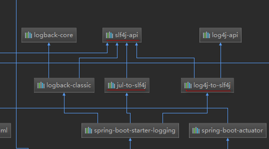
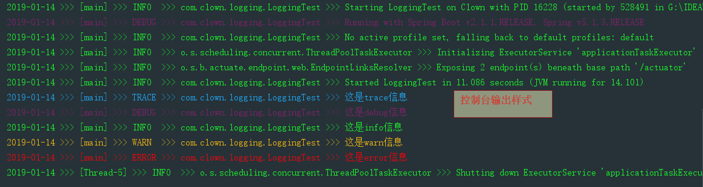

# ***SpringBoot日志框架***

 [SpringBoot官方日志文档](https://docs.spring.io/spring-boot/docs/2.1.2.RELEASE/reference/htmlsingle/#boot-features-logging)

## **1.日志框架**
|日志门面  |日志实现|
|---|---|
| ~~JCL(Jakarta Commons Logging)~~ SLF4j(Simple Logging Facade for Java) ~~jboss-logging~~|Log4j   JUL(java.util.logging)   Log4j2   Logback|
## **2.SpringBoot默认使用的日志框架**
* 日志门面: SLF4j
* 日志实现: Logback
## **3.SLF4J**
* [SLF4J官网](https://www.slf4j.org/manual.html)
* 在开发中,日志记录方法的调用,不应该来直接调用日志的实现类,而是调用日志抽象层里面的方法
* 使用SLF4J日志框架
   * 系统中导入SLF4J的jjar包,logback的实现jar包
   * ```java
        import org.slf4j.Logger;
        import org.slf4j.LoggerFactory;

        public class HelloWorld {
         public static void main(String[] args) {
           Logger logger = LoggerFactory.getLogger(HelloWorld.class);
           logger.info("Hello World");
         }
        }
     ```
* SLF4J日志框架实现图


* 每一个日志的实现框架都有自己的配置文件,使用SLF4J日志框架,配置文件还是使用日志实现框架本身的配置文件
* 当我们使用slf4j日志框架,spring的日志框架使用的是commons-logging,Hbernate的日志框架使用的是jboss-logging,无法统一,所以要统一日志框架
   * [SLF4J官网统一日志框架](https://www.slf4j.org/legacy.html)
   * 如何将系统中的其它日志框架统一到SLF4J框架中
      * 1.将系统中的其他日志框架排除出去
      * 2.用中间包替换原有的日志框架
      * 3.再导入SLF4J其他的实现

   

# ***SpringBoot日志框架分析***

* 
* SpringBoot地层使用的是SLF4J+logback的方式进行日志记录
* SpringBoot也罢其他的日志都替换成SLF4J
* 如果我们要引入其他框架,一定要将这个日志框架的默认日志框架移除

# ***SpringBoot日志框架使用***
* 1.默认配置
   * SoringBoot已经给我们配置好了
   * ```yml
        logging:
          level:
            com.clown: trace
     ```
   * ```java
     @RunWith(SpringJUnit4ClassRunner.class)
     @SpringBootTest
     public class LoggingTest {

         @Test
         public void loggingTest(){
             //日志记录器
             Logger logger = LoggerFactory.getLogger(getClass());

             //日志级别 低-->高  trace<debug<info<warn<error
             //调整级别,设置一个级别,只会打印这个级别到高级别的信息
             //springboot默认使用info级别
             logger.trace("这是trace信息");
             logger.debug("这是debug信息");
             logger.info("这是info信息");
             logger.warn("这是warn信息");
             logger.error("这是error信息");
         }
     }
     ```
* 2.自定义配置
   * ```yml
      logging:
        level:
          com.clown: trace          #日志打印级别
        #path/file互斥
        path: /springboot/log       #在当磁盘下创建springboot文件夹,在springboot文件夹下创建log文件夹,在log文件夹能生成指定名字的spring.log文件
        #file: springboot.log       #不指定路径,当前项目下生成日志文件
        #file: G:/springboot.log    #指定日志生成的路径
        pattern:
          console: "%d{yyyy-MM-dd} >>> [%thread] >>> %-5level >>> %logger{50} >>> %msg%n"               #在控制台指定输出的日志格式
          file: "%d{yyyy-MM-dd} === [%thread] === %-5level === %logger{50} === %msg%n"                  #指定文件的日志输出格式
     ```
   * 
   * 日志输出格式参数

   |参数|功能|
   |---|---|
   | %d |表示日期时间|
   |%thread|表示线程名|
   |%-5level|级别从左显示5个字符宽度|
   |%logger{50}|表示logger名字最长50个字符，否则按照句点分割|
   |%msg|日志消息|
   |%n|是换行符|
   |示例|%d{yyyy-MM-dd} >>> [%thread] >>> %-5level >>> %logger{50} >>> %msg%n|
   * 日志默认配置保存在org.springframework.boot.context.logging配置类中
* 3.SpringBoot自定义日志配置文件
   * [SpringBoot官方日志文档](https://docs.spring.io/spring-boot/docs/2.1.2.RELEASE/reference/htmlsingle/#boot-features-logging)
   * 给类路径下放上每个框架的自己的配置文件即可,springboot就不会使用默认的配置
   * 如果使用lagback实现类,官方建议文件名使用<font color=red>logback-spring.xml</font>,可以使用spring的高级功能
      * logback.xml:直接由日志框架加载
      * logback-spring.xml:日志框架就不加载日志配置项,由springboot进行加载,可以使用高级功能,可以指定某一种配置在某一个环境生效
   ```xml
   <!--使用 logback-spring.xml 文件的高级功能-->
   <layout class="ch.qos.logback.classic.PatternLayout">
       <springProfile name = "dev">  //开发环境输出样式
           <pattern>%d{yyyy-MM-dd HH:mm:ss.SSS} ---> [%thread] ---> %-5level ---> %logger{50} ---> %msg%n</pattern>
       </springProfile>
       <springProfile name = "!dev"> //非开发环境输出样式
           <pattern>%d{yyyy-MM-dd HH:mm:ss.SSS} === [%thread] === %-5level === %logger{50} ===- %msg%n</pattern>
       </springProfile>
   </layout>
   ```
# ***SpringBoot切换日志实现框架为log4j***
* 在POM文件中分析依赖树
* 将logback-classic依赖包排除
* 将log4j-to-slf4j依赖包排除
* 导入slf4j-log4j12依赖
* 引入log4j的配置文件
* 一般不用,没必要试

# ***SpringBoot切换日志框架为log4j2***
* 分析POM依赖树
* 将spring-boot-starter-logging依赖排除
* 引入spring-boot-starter-log4j2依赖
* 使用log4j2-spring.xml日志配置文件(对照log4j.properties文件编写)


