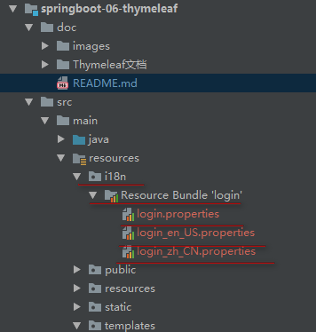

# ***SpringBootWEB开发***

***SpringBoot对WEB的自动配置在org.springframework.boot.autoconfigure.web这个包下***

## ***SpringBootWeb开发资源映射规则***
```java
@Configuration
@ConditionalOnWebApplication(type = Type.SERVLET)
@ConditionalOnClass({ Servlet.class, DispatcherServlet.class, WebMvcConfigurer.class })
@ConditionalOnMissingBean(WebMvcConfigurationSupport.class)
@AutoConfigureOrder(Ordered.HIGHEST_PRECEDENCE + 10)
@AutoConfigureAfter({ DispatcherServletAutoConfiguration.class,
		TaskExecutionAutoConfiguration.class, ValidationAutoConfiguration.class })
public class WebMvcAutoConfiguration {...}
```

```java
//设置和静态资源有关的参数的类
@ConfigurationProperties(prefix = "spring.resources", ignoreUnknownFields = false)
public class ResourceProperties {...}
```
### **1.SpringBootWeb开发对webjars资源映射规则**
```java
@Override
public void addResourceHandlers(ResourceHandlerRegistry registry) {
    if (!this.resourceProperties.isAddMappings()) {
        logger.debug("Default resource handling disabled");
        return;
    }
    Duration cachePeriod = this.resourceProperties.getCache().getPeriod();
    CacheControl cacheControl = this.resourceProperties.getCache()
            .getCachecontrol().toHttpCacheControl();
    if (!registry.hasMappingForPattern("/webjars/**")) {
        customizeResourceHandlerRegistration(registry
                .addResourceHandler("/webjars/**")
                .addResourceLocations("classpath:/META-INF/resources/webjars/")
                .setCachePeriod(getSeconds(cachePeriod))
                .setCacheControl(cacheControl));
    }
    String staticPathPattern = this.mvcProperties.getStaticPathPattern();
    if (!registry.hasMappingForPattern(staticPathPattern)) {
        customizeResourceHandlerRegistration(
                registry.addResourceHandler(staticPathPattern)
                        .addResourceLocations(getResourceLocations(
                                this.resourceProperties.getStaticLocations()))
                        .setCachePeriod(getSeconds(cachePeriod))
                        .setCacheControl(cacheControl));
    }
}
```
* /webjars/** : 所有<font color=#00FFFF size=5>/webjars/**</font>路径下的资源访问都去<font color=#00FFFF size=5>classpath:/META-INF/resources/webjars/</font>路径下寻找
   * 

   * webjars:以jar包的方式引入静态资源
   * 将我们需要使用的前端框架,如:js,jq,boostrap等以jar包的形式引入进来
   * [webjars官网](https://www.webjars.org/)

* POM文件中引入jQuery的jar包
```yaml
<!-- 引入jQuery的jar包 -->
<dependency>
    <groupId>org.webjars</groupId>
    <artifactId>jquery</artifactId>
    <version>3.3.1</version>
</dependency>
```
* 访问时只需要写webjars下面资源的名称即可
   * [访问本工程的webjars下的文件](http://localhost:8080/webjars/jquery/3.3.1/jquery.js)

     

### **2.SpringBootWeb开发对静态资源映射规则**
* /** :访问当前项目的任何资源(静态资源的文件夹,你的静态资源就放到这几个文件夹中)
   * ```java
     classpath:/META-INF/resources/
     classpath:/resources/
     classpath:/static/
     classpath:/public/
     / 当前项目的根路径
   	 ```
* 访问asserts文件夹下js的内容
   * [访问asserts中的静态资源](http://localhost:8080/asserts/js/Chart.min.js)
### **3.SpringBootWeb开发对首页资源映射规则**
   * 静态资源下的所有index.html页面
   * ```java
         @Bean
         public WelcomePageHandlerMapping welcomePageHandlerMapping(ApplicationContext applicationContext) {
             return new WelcomePageHandlerMapping(
                 new TemplateAvailabilityProviders(applicationContext),
                 applicationContext, getWelcomePage(),
                 this.mvcProperties.getStaticPathPattern());
         }
        ```
   * 访问当前项目项目下的首页
   [访问当前项目的首页](http://localhost:8080/)
### **4.SpringBootWeb开发对图标映射规则**
   * 所有的favicon.ico都是在静态资源文件下找
```java
@Configuration
@ConditionalOnProperty(value = "spring.mvc.favicon.enabled", matchIfMissing = true)
public static class FaviconConfiguration implements ResourceLoaderAware {

    private final ResourceProperties resourceProperties;

    private ResourceLoader resourceLoader;

    public FaviconConfiguration(ResourceProperties resourceProperties) {
        this.resourceProperties = resourceProperties;
    }

    @Override
    public void setResourceLoader(ResourceLoader resourceLoader) {
        this.resourceLoader = resourceLoader;
    }

    @Bean
    public SimpleUrlHandlerMapping faviconHandlerMapping() {
        SimpleUrlHandlerMapping mapping = new SimpleUrlHandlerMapping();
        mapping.setOrder(Ordered.HIGHEST_PRECEDENCE + 1);
        //任何路径下的favicon.ico文件作为图标
        mapping.setUrlMap(Collections.singletonMap("**/favicon.ico",faviconRequestHandler()));
        return mapping;
    }

    @Bean
    public ResourceHttpRequestHandler faviconRequestHandler() {
        ResourceHttpRequestHandler requestHandler = new ResourceHttpRequestHandler();
        requestHandler.setLocations(resolveFaviconLocations());
        return requestHandler;
    }

    private List<Resource> resolveFaviconLocations() {
        String[] staticLocations = getResourceLocations(this.resourceProperties.getStaticLocations());
        List<Resource> locations = new ArrayList<>(staticLocations.length + 1);
        Arrays.stream(staticLocations).map(this.resourceLoader::getResource)
                .forEach(locations::add);
        locations.add(new ClassPathResource("/"));
        return Collections.unmodifiableList(locations);
    }
}
```

### **5.SpringBootWeb开发对自定义静态资源映射规则**
```yaml
spring:
  resources:
    static-locations: 你自己的静态文件夹名称
```

## ***SpringBootWeb开发案例***

**<font color=red size=6>使用Thymeleaf模板引擎时在全局配置文件中将缓存关闭</font>**
```yaml
spring:
  thymeleaf:
    cache: false
```

### **1.引入thymeleaf依赖**
[thymeleaf官网](https://www.thymeleaf.org/documentation.html)
[GitHub地址](https://github.com/thymeleaf/thymeleaf)
[SpringBoot官方文档](https://docs.spring.io/spring-boot/docs/1.5.19.RELEASE/reference/htmlsingle/#howto-use-thymeleaf-3)
```pom
<dependencies>
    <!-- 引入jQuery的jar包 -->
    <dependency>
        <groupId>org.webjars</groupId>
        <artifactId>jquery</artifactId>
        <version>3.3.1</version>
    </dependency>

    <!-- 引入thymeleaf依赖 -->
    <dependency>
        <groupId>org.springframework.boot</groupId>
        <artifactId>spring-boot-starter-thymeleaf</artifactId>
    </dependency>

    <!-- 引入layout组件依赖 这个不写版本号也可以,spring-boot-dependencies中用的也是2.3.0版本-->
    <dependency>
        <groupId>nz.net.ultraq.thymeleaf</groupId>
        <artifactId>thymeleaf-layout-dialect</artifactId>
        <version>2.3.0</version>
    </dependency>
</dependencies>
```
<font color=red size=6>thymeleaf 3.X以上的版本对应layout-dialect2.X以上的版本</font>
[Thymeleaf与layout对应关系](https://github.com/ultraq/thymeleaf-layout-dialect/releases)
### **2.SpringBoot对于thymeleaf的配置**
* 自动配置类:org.springframework.boot.autoconfigure.thymeleaf.ThymeleafAutoConfiguration
* Thymeleaf默认规则:org.springframework.boot.autoconfigure.thymeleaf.ThymeleafProperties
```java
@ConfigurationProperties(prefix = "spring.thymeleaf")
public class ThymeleafProperties {

    //默认编码UTF-8
    private static final Charset DEFAULT_ENCODING = StandardCharsets.UTF_8;

    //默认静态页面路径路径classpath:/templates/
    //只要将HTML页面放入classpath:/templates/这个路径下.thymeleaf就能给我们自动渲染
    public static final String DEFAULT_PREFIX = "classpath:/templates/";

    //默认后缀.html
    public static final String DEFAULT_SUFFIX = ".html";

    private boolean checkTemplate = true;

    private boolean checkTemplateLocation = true;

    private String prefix = DEFAULT_PREFIX;

    private String suffix = DEFAULT_SUFFIX;

    private String mode = "HTML";

    private Charset encoding = DEFAULT_ENCODING;

    //开启页面缓存 true
    private boolean cache = true;

    private Integer templateResolverOrder;

    private String[] viewNames;

    private String[] excludedViewNames;

    private boolean enableSpringElCompiler;

    private boolean renderHiddenMarkersBeforeCheckboxes = false;

    private boolean enabled = true;

    private final Servlet servlet = new Servlet();

    private final Reactive reactive = new Reactive();
}
```
### **3.Thymeleaf的语法使用**
* [Thymeleaf官方文档](https://www.thymeleaf.org/doc/tutorials/3.0/usingthymeleaf.html)
* 中文文档详见:springboot-06-thymeleaf/doc/Thymeleaf文档/thymeleaf_3.0.5_中文参考手册.pdf

* 使用Thymeleaf
   * 页面导入Thymeleaf的名称空间[有语法提示]
     ```html
     <html lang="en" xmlns:th="http://www.thymeleaf.org">
     ```
   * 使用Thymeleaf语法
     ```html
     <body>
         <h1>成功</h1>
         <!-- 将div里面的文本内容设置为我们制定的值-->
         <div th:text="${listen}"></div>
     </body>
     ```
   * [访问](http://localhost:8080/listen/success)

* <font color=red size=5>th</font>语法规则
   * <font color=#00FFFF>th:text</font>: 改变当前元素里面文本的内容
   * <font color=#00FFFF>th:任意HTML属性</font>:替换原生属性的值
      * 页面代码
        ```html
        <!DOCTYPE html>
        <html lang="en" xmlns:th="http://www.thymeleaf.org">
            <head>
                <meta charset="UTF-8">
                <title>成功</title>
            </head>
            <body>
                <h1>成功</h1>
                <!-- 将div里面的文本内容设置为我们制定的值-->
                <div id="div_01" class="class_01" th:id="${listen}" th:class="${listen}" th:text="${listen}"></div>
            </body>
         </html>
         ```
      * 页面源码
        ```html
        <!DOCTYPE html>
        <html lang="en">
            <head>
                <meta charset="UTF-8">
                <title>成功</title>
            </head>
            <body>
                <h1>成功</h1>
                <!-- 将div里面的文本内容设置为我们制定的值-->
                <div id="clown is laughing at you..." class="clown is laughing at you...">clown is laughing at you...</div>
            </body>
        </html>
        ```
   * 

   * [th语法规则参考](https://www.thymeleaf.org/doc/tutorials/3.0/usingthymeleaf.html#attribute-precedence)
* <font color=red size=5>表达式语法规则</font>
   * [表达式参考文档](https://www.thymeleaf.org/doc/tutorials/3.0/usingthymeleaf.html#standard-expression-syntax)
   * 表达式语法


   | 名称 |写法|文档|
   |---|---|---|
   | 变量表达式|${...} |[Variables](https://www.thymeleaf.org/doc/tutorials/3.0/usingthymeleaf.html#variables)|
   | 选择表达式 |*{...}|[ Expressions on selections ](https://www.thymeleaf.org/doc/tutorials/3.0/usingthymeleaf.html#expressions-on-selections-asterisk-syntax)|
   |Messages|#{...}|[Messages](https://www.thymeleaf.org/doc/tutorials/3.0/usingthymeleaf.html#messages)|
   |Link URLs|@{...}|[Link URLs](https://www.thymeleaf.org/doc/tutorials/3.0/usingthymeleaf.html#link-urls)|
   |Fragments|~{...}|[Fragments](https://www.thymeleaf.org/doc/tutorials/3.0/usingthymeleaf.html#fragments)|

### **4.SpringBootWeb开发对SpringMvc的默认配置**
* [SpringMVC自动配置官网](https://docs.spring.io/spring-boot/docs/2.1.2.RELEASE/reference/htmlsingle/#boot-features-developing-web-applications)
* [SpringMVC默认配置官方介绍](https://docs.spring.io/spring-boot/docs/2.1.2.RELEASE/reference/htmlsingle/#boot-features-spring-mvc-auto-configuration)
* SpringMVC的自动配置在org.springframework.boot.autoconfigure.web.servlet.WebMvcAutoConfiguration这个类中

### **5.SpringBootWeb开发对SpringMvc的扩展配置**
* 编写一个配置类,使用<font color=red size=6>@Configuration</font>注解签名的类
* <font color=red>这种方式即保留了springmvc的自动配置,又使用了我们的自定义配置</font>
* 配置类
  ```java
  /**
   * @author: Richard·Ackerman
   * @create: 2019/1/15
   * springboot 2.0 之后直接实现 WebMvcConfigurer接口就可以
   **/
  @Configuration
  public class MyMvcConfig implements WebMvcConfigurer {
      @Override
      public void addViewControllers(ViewControllerRegistry registry) {
          //浏览器发送listening请求,返回给浏览器listening页面
          registry.addViewController("/listening").setViewName("success/listening");
      }
  }
  ```
* 创建视图页面
  ```html
  <!DOCTYPE html>
  <html lang="en">
  <head>
      <meta charset="UTF-8">
      <title>Listening</title>
  </head>
  <body>
      <h1 style="color:red">clown is laughing at you...</h1>
  </body>
  </html>
  ```
* 访问页面

  
* 原理
   * WebMvcAutoConfiguration是springMVC的自动配置类
   * 在做其他配置时,会导入@Import(EnableWebMvcConfiguration.class)
     ```java
     @Configuration
     public static class EnableWebMvcConfiguration extends DelegatingWebMvcConfiguration {...}
     ```
     ```java
     @Configuration
     public class DelegatingWebMvcConfiguration extends WebMvcConfigurationSupport {

     	private final WebMvcConfigurerComposite configurers = new WebMvcConfigurerComposite();

        //从容器中获取所有的WebMvcConfigurer
     	@Autowired(required = false)
     	public void setConfigurers(List<WebMvcConfigurer> configurers) {
     		if (!CollectionUtils.isEmpty(configurers)) {
     			this.configurers.addWebMvcConfigurers(configurers);
     		}
     	}
     	...
     	@Override
        protected void addViewControllers(ViewControllerRegistry registry) {
        	this.configurers.addViewControllers(registry);
        }
     ```
     ```java
     @Override
     public void addViewControllers(ViewControllerRegistry registry) {
     	for (WebMvcConfigurer delegate : this.delegates) {
     		delegate.addViewControllers(registry);
        }
     }
     ```
   * 容器中所有的webConfiguration都会一起起作用
   * 我们的配置类也会被调用,springmvcd的自动配置和我们的扩展配置都会起作用
   * 我们的配置类不能标注@EnableWebMvc,如果想完全掌控Springmvc,则我们的配置类要加上这个注解

     

### **6.全面接管SpringBootWeb开发对SpringMvc的配置**
* SpringBoot对SpringMvc的自动配置我们都不用,所有我们都自己配
* 我们需要在配置类上加<font color=red size=6>@EnableWebMvc</font>
* 实现
   * ```java
     @EnableWebMvc
     @Configuration
     public class MyMvcConfig implements WebMvcConfigurer {
         @Override
         public void addViewControllers(ViewControllerRegistry registry) {
             //浏览器发送listening请求,返回给浏览器listening页面
             registry.addViewController("/listening").setViewName("success/listening");
         }
     }
     ```
   * 访问 http://localhost:8080/listening

     

     访问 http://localhost:8080/listen

     

     

* 总结:

| 做法 |SpringBoot对SpringMvc的自动配置是否失效|
|---|---|
| implements WebMvcConfigurer |自动配置不失效|
| @EnableWebMvc + implements WebMvcConfigurer |自动配置失效|
| extends WebMvcConfigurationSupport |自动配置失效|
| extends DelegatingWebMvcConfiguration |自动配置失效|

* 原理
   * 为什么+@EnableWebMvc这个注解自动配置就失效
   * ```java
     @Retention(RetentionPolicy.RUNTIME)
     @Target(ElementType.TYPE)
     @Documented
     @Import(DelegatingWebMvcConfiguration.class)
     public @interface EnableWebMvc {}
     ```
   * ```java
     @Configuration
     public class DelegatingWebMvcConfiguration extends WebMvcConfigurationSupport {...}
     ```
   * ```java
     @Configuration
     @ConditionalOnWebApplication(type = Type.SERVLET)
     @ConditionalOnClass({ Servlet.class, DispatcherServlet.class, WebMvcConfigurer.class })
     //判断容器中没有WebMvcConfigurationSupport这个组件的时候,这个配置类才会生效
     @ConditionalOnMissingBean(WebMvcConfigurationSupport.class)
     @AutoConfigureOrder(Ordered.HIGHEST_PRECEDENCE + 10)
     @AutoConfigureAfter({ DispatcherServletAutoConfiguration.class,
     		TaskExecutionAutoConfiguration.class, ValidationAutoConfiguration.class })
     public class WebMvcAutoConfiguration {...}
     ```
   * <font color= red size=6>@EnableWebMvc帮我们导入了WebMvcConfigurationSupport这个组件,所以自动配置类就不生效了</font>

# ***如何修改SpringBoot的默认配置***
* SpringBoot在自动配置很多组件的时候,先看容器中有没有用户自己配置的组件
   * 如果有就用用户配置的
   * 如果没有才自动配置
   * 如果有些组件有多个,那么用户配置和默认的组合使用

# ***SpringBootWeb开发CRUD***

### **1引入静态资源,修改页面静态资源路径[略]**

### **2.国际化**
* SpringMVC做法
   * 编写国际化配置文件
   * 使用ResourceBundleMessageSource管理国际化资源文件
   * 在JSP页面使用fmt:message标签取出国际化内容
* SpringBoot做法
   * 编写国际化配置文件,抽取页面要显示的国际化消息
      * 在resources目录下创建i18n目录
      * 添加 login.properties文件<font color=red>国际化文件必须是properties文件类型</font>
      * idea自动识别国际化文件,自动创建文件夹

        
      * 分别在文件中编辑页面要显示的国际化内容
         * login.properties
         ```properties
         login.btn=登录~
         login.password=密码~
         login.remember=记住我~
         login.tip=请登录~
         login.username=用户名~
         ```
         * login_en_US.properties
         ```properties
         login.btn=Sign In
         login.password=Password
         login.remember=Remember Me
         login.tip=Please sign in
         login.username=UserName
         ```
         * login_zh_CN.properties
         ```properties
         login.btn=登录
         login.password=密码
         login.remember=记住我
         login.tip=请登录
         login.username=用户名
         ```
   * SpringBoot 已经自动配置好了管理国际化资源配置的组件[MessageSourceAutoConfiguration]
     看整个配置类,下面有点问题
     ```java
     @Configuration
     @ConditionalOnMissingBean(value = MessageSource.class, search = SearchStrategy.CURRENT)
     @AutoConfigureOrder(Ordered.HIGHEST_PRECEDENCE)
     @Conditional(ResourceBundleCondition.class)
     @EnableConfigurationProperties
     public class MessageSourceAutoConfiguration {

       //我们的文件可以直接放在类路径下叫messageproperties即可
       private static final Resource[] NO_RESOURCES = {};

       @Bean
       @ConfigurationProperties(prefix = "spring.messages")
       public MessageSourceProperties messageSourceProperties() {
     	return new MessageSourceProperties();
       }

     @Bean
     public MessageSource messageSource(MessageSourceProperties properties) {
       ResourceBundleMessageSource messageSource = new ResourceBundleMessageSource();
       if (StringUtils.hasText(properties.getBasename())) {
         //设置国际化资源的基础名(去掉语言国家代码的)
         messageSource.setBasenames(StringUtils.commaDelimitedListToStringArray(
                 StringUtils.trimAllWhitespace(properties.getBasename())));
        }
       if (properties.getEncoding() != null) {
         messageSource.setDefaultEncoding(properties.getEncoding().name());
       }
       messageSource.setFallbackToSystemLocale(properties.isFallbackToSystemLocale());
       Duration cacheDuration = properties.getCacheDuration();
       if (cacheDuration != null) {
          messageSource.setCacheMillis(cacheDuration.toMillis());
       }
       messageSource.setAlwaysUseMessageFormat(properties.isAlwaysUseMessageFormat());
       messageSource.setUseCodeAsDefaultMessage(properties.isUseCodeAsDefaultMessage());
       return messageSource;
       }
     }
     ```
   * 在核心配置文件中配置国际化文件
     ```yml
     spring:
       thymeleaf:
         cache: false
       datasource:
         driver-class-name: com.mysql.cj.jdbc.Driver
         url: jdbc:mysql://localhost:3306/springboot-thymeleaf?useUnicode=true&characterEncoding=utf8&serverTimezone=GMT%2B8
         username: root
         password: "123456"
       messages:
         basename: i18n.login       #配置国际化文件
     logging:
       level:
         com.clown.thymeleaf.mapper: debug
     ```
   * 去页面获取国际化的值
      * 使用thymeleaf的 #{...} 标签获取值
        ```html
        <body class="text-center">
            <form class="form-signin" action="dashboard.html">
                
                <h1 class="h3 mb-3 font-weight-normal" th:text="#{login.tip}">Please sign in</h1>
                <label class="sr-only" th:text="#{login.username}">Username</label>
                <input type="text" class="form-control" placeholder="Username" th:placeholder="#{login.username}" required="" autofocus="">
                <label class="sr-only" th:text="#{login.password}">Password</label>
                <input type="password" class="form-control" placeholder="Password" th:text="#{login.password}" required="">
                <div class="checkbox mb-3">
                    <label>
              <input type="checkbox" value="remember-me"> [[#{login.remember}]]
            </label>
                </div>
                <button class="btn btn-lg btn-primary btn-block" type="submit" th:text="#{login.btn}">Sign in</button>
                <p class="mt-5 mb-3 text-muted">© 2017-2018</p>
                <a class="btn btn-sm">中文</a>
                <a class="btn btn-sm">English</a>
            </form>
        	</body>
        ```
      * [浏览器访问](http://localhost:8080/)
         * 出现乱码解决方法[略]
         * 切换浏览器语言设置的信息试一试
      * 实现点击中英文按钮实现语言切换
         * 国际化local区域信息对象: LocaleResolver[获取区域信息对象]
         * 在WebMvcAutoConfiguration自动配置类中
           ```java
           @Bean
           @ConditionalOnMissingBean
           @ConditionalOnProperty(prefix = "spring.mvc", name = "locale")
           public LocaleResolver localeResolver() {
               if (this.mvcProperties
                       .getLocaleResolver() == WebMvcProperties.LocaleResolver.FIXED) {
                   return new FixedLocaleResolver(this.mvcProperties.getLocale());
               }
               AcceptHeaderLocaleResolver localeResolver = new AcceptHeaderLocaleResolver();
               localeResolver.setDefaultLocale(this.mvcProperties.getLocale());
               return localeResolver;
           }
           ```
         * AcceptHeaderLocaleResolver中的这个方法就是根据请求头带来的区域信息获取Locale进行国际化
           ```java
           @Override
           public Locale resolveLocale(HttpServletRequest request) {
            Locale defaultLocale = getDefaultLocale();
          		if (defaultLocale != null && request.getHeader("Accept-Language") == null) {
          			return defaultLocale;
          		}
          		Locale requestLocale = request.getLocale();
          		List<Locale> supportedLocales = getSupportedLocales();
          		if (supportedLocales.isEmpty() || supportedLocales.contains(requestLocale)) {
          			return requestLocale;
          		}
          		Locale supportedLocale = findSupportedLocale(request, supportedLocales);
          		if (supportedLocale != null) {
           			return supportedLocale;
           		}
           	    return (defaultLocale != null ? defaultLocale : requestLocale);
           }
           ```
         * 创建配置类
           ```java
           /**
            * @author: Richard·Ackerman
            * @create: 2019/1/16
            *
            * 此配置是为了点击按钮实现中英文转换
            * 可以在连接上携带国际化的区域信息
            *
            **/
           public class MyLocaleResolve implements LocaleResolver {

               @Override
               public Locale resolveLocale(HttpServletRequest request) {
                   String language = request.getParameter("l");
                   Locale locale = Locale.getDefault();
                   if (!StringUtils.isEmpty(language)) {
                       String[] str = language.split("_");
                       BiFunction<String,String,Locale> fun = Locale::new;
                       locale = fun.apply(str[0], str[1]);
                   }
                   return locale;
               }

               @Override
               public void setLocale(HttpServletRequest request, HttpServletResponse response, Locale locale) {

               }
           }
           ```
         * 将配置类放入容器中
           ```java
           //将我们自定义的国际化组件放入容器中
           @Bean
           public LocaleResolver localeResolver(){
               return new MyLocaleResolve();
           }
           ```

### **3.配置登录页面**
* 使用模板引擎修改页面内容后,要将工程重新编译 CTRL+F9
* thymeleaf模板引擎开发时要关闭缓存
* 用户登录功能代码[略]
* 登录错误消息显示
```html
<!-- 判断如果用户登录失败才显示此提示信息-->
<p style="color:blue" th:text="${msg}" th:if="${not #strings.isEmpty(msg)}"></p>
```

### **4.登录成功后进行重定向**
* 问题:
   * 登录成功后,F5刷新后进行表达提交问题,
   * 原因:因为是从login方法进行转发到成功页面,所以会出现重复提交表单问题
* 解决
   * 添加一个试图映射
   ```java
     registry.addViewController("/main.html").setViewName("dashboard");
   ```
   * 修改controller方法
   ```java
   @PostMapping("/login")
   public String login(@RequestParam("username") String username, @RequestParam("password") String password, Map<String,Object> map){
       User user = userService.login(username, password);
           if (null == user) {
               map.put("msg","用户名或密码错误!!!");
               return "/login";
           }
           //登陆成功后,防止表单重复提交,可以重定向到主页
           return "redirect:/main.html";
       }
   ```

### **5.拦截器进行登录检查**
* 创建自定义拦截器
```java
/**
 * @author: Richard·Ackerman
 * @create: 2019/1/16
 *
 * 进行登录检查,未登录不能访问后台
 *
 **/
public class LoginHandlerInterceptor implements HandlerInterceptor {

    //目标方法执行之前
    @Override
    public boolean preHandle(HttpServletRequest request, HttpServletResponse response, Object handler) throws Exception {
        Object username = request.getSession().getAttribute("loginUser");
        if (null == username) {
            //说明用户未登录,返回登录页面
            request.setAttribute("msg","请先登录!!!");
            request.getRequestDispatcher("/index.html").forward(request,response);
            return false;
        }
        return true;
    }
}
```

* 将拦截器组件添加到spring容器中
```java
@Bean
public WebMvcConfigurer webMvcConfigurer(){
    return new WebMvcConfigurer(){
        @Override
        public void addViewControllers(ViewControllerRegistry registry) {
            registry.addViewController("/").setViewName("login");
            registry.addViewController("/index.html").setViewName("login");
            registry.addViewController("/main.html").setViewName("dashboard");
        }

        //注册拦截器 //静态资源在springboot2.0发生改变,还是要放行
        @Override
        public void addInterceptors(InterceptorRegistry registry) {
            registry.addInterceptor(new LoginHandlerInterceptor()).addPathPatterns("/**")
                    .excludePathPatterns("/index.html","/","/user/login")
                    .excludePathPatterns("/asserts/css/**","/asserts/js/**","/asserts/img/**","/webjars/**");
        }
    };
}
```
<font color=red size =6>注意:在springboot2.0后,拦截的资源 "/**" 后,所有资源都拦截,包括静态资源,所以放行静态资源,注意放行的静态资源的路径写法</font>

### **6.抽取公共片段**
* [Thymeleaf官方文档](https://www.thymeleaf.org/doc/tutorials/3.0/usingthymeleaf.html#including-template-fragments)
* 抽取公共片段
```html
<!DOCTYPE html>
<html xmlns:th="http://www.thymeleaf.org">
  <body>
    <div th:fragment="copy">
      公共片段
    </div>
  </body>
</html>
```

* 引入公共片段
   * ```html
     <body>
       ...
       <div th:insert="~{footer :: copy}"></div>
     </body>
     ```
   * ```html
     <body>
       ...
       <div th:insert="footer :: copy"></div>
     </body>
     ```
   * 两种方式
      * <font color=red size=5>~{templatename::selector}</font>模板名::选择器
      * <font color=red size=5>~{templatename::fragmentname}</font>模板名::片段名
* 默认效果:
   * insert的公共片段就在div标签中
   * 如果使用:th:inserd等属性进行引入,可以不用写 ~{},行内写法要加 [[~{}]]
* 3种引入公共片段的方法
   * [官方文档](https://www.thymeleaf.org/doc/tutorials/3.0/usingthymeleaf.html#difference-between-thinsert-and-threplace-and-thinclude)
   * *th:insert* :  <font color=red>将公共片段整个插入到声明引入的元素中</font>
   * *th:replace* : <font color=red>将声明引入的元素替换为公共片段</font>
   * *th:include* : <font color=red>将被引入的片段的内容包含进这个标签中</font>
   * ```html
     <footer th:fragment="copy">
       &copy; 2011 The Good Thymes Virtual Grocery
     </footer>

     <div th:insert="footer :: copy"></div>
     <div th:replace="footer :: copy"></div>
     <div th:include="footer :: copy"></div>

      效果
      <body>
        ...
        <div>
          <footer>
            &copy; 2011 The Good Thymes Virtual Grocery
          </footer>
        </div>

        <footer>
          &copy; 2011 The Good Thymes Virtual Grocery
        </footer>

        <div>
          &copy; 2011 The Good Thymes Virtual Grocery
        </div>
      </body>
     ```

# ***员工列表CRUD***

## **1.需求**
* Restful的CRUD:满足restful风格
   * URI: /资源名称/资源标识,以请求方式区分CRUD操作


| 操作 |普通CRUD(uri来区分操作)|restful的CRUD|
|---|---|---|
| 查询 |getEmp|emp---GET|
| 添加 |addEmp?XXX|emp---POST|
| 修改 |updateEmp?id=1&xx=xx&xx=xx|emp/{id}---PUT|
| 删除 |deleteEmp?id=1|emp/{id}---DELETE|
| 总结 ||以请求方式区分要访问的方法,以资源区分要访问的功能|

## **2.本工程要求**


| 操作 |请求路径|请求方式|
|---|---|---|
| 查询所有员工 |employee/findAll|GET|
| 查询一个员工 |employee/findById/{id}|get|
| 添加(跳转到添加页面) |/employee/goToDetil|GET|
| 添加 |employee|POST|
| 修改(来到修改页面进行员工信息回显) |employee/findById/{id}|GET|
| 修改 |employee/{id}|PUT|
| 删除(删除完成后显示员工列表) |employee/{id}|DELETE|

## **3.实现功能**
### **1.查询所有员工列表**
* 过程[l略]
* [Thymeleaf日期格式化文档](https://www.thymeleaf.org/doc/tutorials/3.0/usingthymeleaf.html#dates)

### **2.员工添加**
* controller添加页面跳转你的方法
* 页面添加跳转的按钮
* 添加员工信息表单页面
* 页面加载时查询出所有的部门


# ***自定义错误机制***

## **原理**
<font color=red size=5>ErrorMvcAutoConfiguration 错误处理自动配置类</font>

* DefaultErrorAttributes
   * 帮我们在页面共享信息
     ```java
     @Override
     	public Map<String, Object> getErrorAttributes(WebRequest webRequest,
     			boolean includeStackTrace) {
     		Map<String, Object> errorAttributes = new LinkedHashMap<>();
     		errorAttributes.put("timestamp", new Date());
     		addStatus(errorAttributes, webRequest);
     		addErrorDetails(errorAttributes, webRequest, includeStackTrace);
     		addPath(errorAttributes, webRequest);
     		return errorAttributes;
     	}
     ```
* ErrorPageCustomizer
   * ```java
        @Value("${error.path:/error}")
        	private String path = "/error"; 系统出现错误以后来到error请求进行处理
     ```
* BasicErrorController  处理默认的/error请求
   * ```java
     @Controller
     @RequestMapping("${server.error.path:${error.path:/error}}")
     public class BasicErrorController extends AbstractErrorController {

     @RequestMapping(produces = MediaType.TEXT_HTML_VALUE) //产生HTML类型的错误 浏览器发送的请求来到这个方法处理
     public ModelAndView errorHtml(HttpServletRequest request,HttpServletResponse response) {
     	HttpStatus status = getStatus(request);
     	Map<String, Object> model = Collections.unmodifiableMap(getErrorAttributes(request, isIncludeStackTrace(request, MediaType.TEXT_HTML)));
     	response.setStatus(status.value());
     	//去哪个页面作为错误页面
     	ModelAndView modelAndView = resolveErrorView(request, response, status, model);
     	return (modelAndView != null) ? modelAndView : new ModelAndView("error", model);
     }

     @RequestMapping  //产生json数据 其他客户端来到这个方法处理
     public ResponseEntity<Map<String, Object>> error(HttpServletRequest request) {
         Map<String, Object> body = getErrorAttributes(request,
                isIncludeStackTrace(request, MediaType.ALL));
         HttpStatus status = getStatus(request);
         return new ResponseEntity<>(body, status);
     }
     }

     ```
* DefaultErrorViewResolver

* 步骤
   * 一旦系统出现4XX,5XX之类的错误,ErrorPageCustomizer就会生效(定制错误响应规则),就会来到/error请求,就会被 BasicErrorController 处理
      * 响应页面:去那个页面是由 ErrorViewResolver 解析得到的
         * ```java
           protected ModelAndView resolveErrorView(HttpServletRequest request,
           			HttpServletResponse response, HttpStatus status, Map<String, Object> model) {
           			//所有的ErrorViewResolver得到modelAndView
           		for (ErrorViewResolver resolver : this.errorViewResolvers) {
           			ModelAndView modelAndView = resolver.resolveErrorView(request, status, model);
           			if (modelAndView != null) {
           				return modelAndView;
           			}
           		}
           		return null;
           	}
           ```

## **如何定制错误响应**
* 如何定制错误页面
   * 有模板引擎的情况下:error/状态码 ,将错误页面命名为 错误状态码.html,放入到模板引擎的error文件夹下就可以,发生此状态码的错误就会响应该错误页面
   * 我们可以使用4xx或5xx作为错误页面的的文件名来匹配这些错误,精确优先(优先查找精确地状态码.html)
* 如何定制json错误信息


