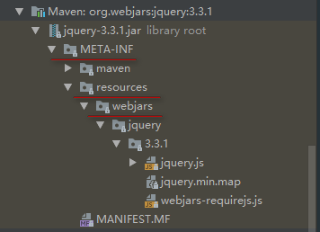
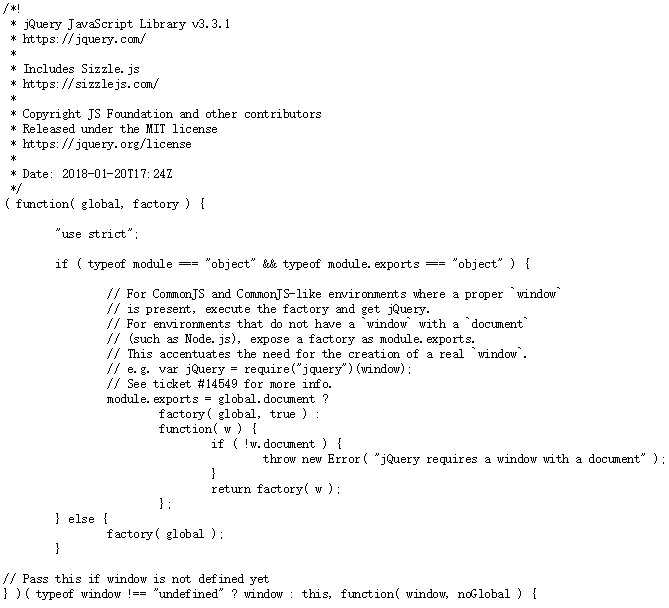
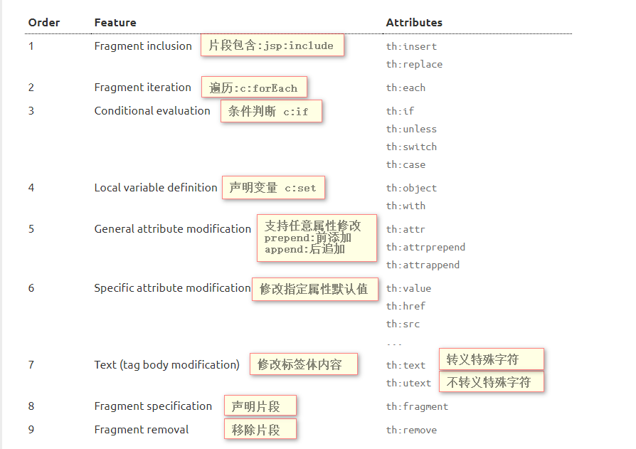
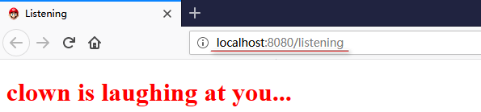
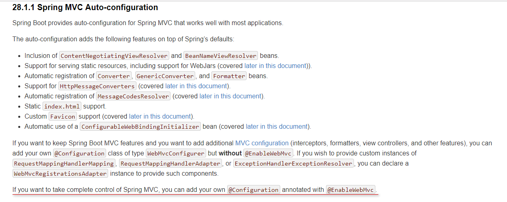
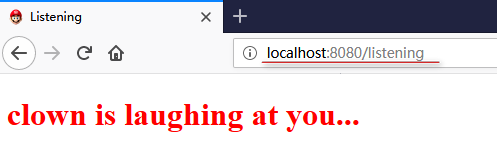
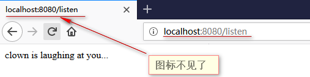
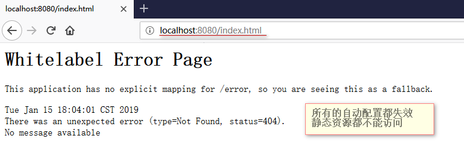

# ***SpringBootWEB开发***

***SpringBoot对WEB的自动配置在org.springframework.boot.autoconfigure.web这个包下***

## ***SpringBootWeb开发资源映射规则***
```java
@Configuration
@ConditionalOnWebApplication(type = Type.SERVLET)
@ConditionalOnClass({ Servlet.class, DispatcherServlet.class, WebMvcConfigurer.class })
@ConditionalOnMissingBean(WebMvcConfigurationSupport.class)
@AutoConfigureOrder(Ordered.HIGHEST_PRECEDENCE + 10)
@AutoConfigureAfter({ DispatcherServletAutoConfiguration.class,
		TaskExecutionAutoConfiguration.class, ValidationAutoConfiguration.class })
public class WebMvcAutoConfiguration {...}
```

```java
//设置和静态资源有关的参数的类
@ConfigurationProperties(prefix = "spring.resources", ignoreUnknownFields = false)
public class ResourceProperties {...}
```
### **1.SpringBootWeb开发对webjars资源映射规则**
```java
@Override
public void addResourceHandlers(ResourceHandlerRegistry registry) {
    if (!this.resourceProperties.isAddMappings()) {
        logger.debug("Default resource handling disabled");
        return;
    }
    Duration cachePeriod = this.resourceProperties.getCache().getPeriod();
    CacheControl cacheControl = this.resourceProperties.getCache()
            .getCachecontrol().toHttpCacheControl();
    if (!registry.hasMappingForPattern("/webjars/**")) {
        customizeResourceHandlerRegistration(registry
                .addResourceHandler("/webjars/**")
                .addResourceLocations("classpath:/META-INF/resources/webjars/")
                .setCachePeriod(getSeconds(cachePeriod))
                .setCacheControl(cacheControl));
    }
    String staticPathPattern = this.mvcProperties.getStaticPathPattern();
    if (!registry.hasMappingForPattern(staticPathPattern)) {
        customizeResourceHandlerRegistration(
                registry.addResourceHandler(staticPathPattern)
                        .addResourceLocations(getResourceLocations(
                                this.resourceProperties.getStaticLocations()))
                        .setCachePeriod(getSeconds(cachePeriod))
                        .setCacheControl(cacheControl));
    }
}
```
* /webjars/** : 所有<font color=#00FFFF size=5>/webjars/**</font>路径下的资源访问都去<font color=#00FFFF size=5>classpath:/META-INF/resources/webjars/</font>路径下寻找
   * 

   * webjars:以jar包的方式引入静态资源
   * 将我们需要使用的前端框架,如:js,jq,boostrap等以jar包的形式引入进来
   * [webjars官网](https://www.webjars.org/)

* POM文件中引入jQuery的jar包
```yaml
<!-- 引入jQuery的jar包 -->
<dependency>
    <groupId>org.webjars</groupId>
    <artifactId>jquery</artifactId>
    <version>3.3.1</version>
</dependency>
```
* 访问时只需要写webjars下面资源的名称即可
   * [访问本工程的webjars下的文件](http://localhost:8080/webjars/jquery/3.3.1/jquery.js)

     

### **2.SpringBootWeb开发对静态资源映射规则**
* /** :访问当前项目的任何资源(静态资源的文件夹,你的静态资源就放到这几个文件夹中)
   * ```java
     classpath:/META-INF/resources/
     classpath:/resources/
     classpath:/static/
     classpath:/public/
     / 当前项目的根路径
   	 ```
* 访问asserts文件夹下js的内容
   * [访问asserts中的静态资源](http://localhost:8080/asserts/js/Chart.min.js)
### **3.SpringBootWeb开发对首页资源映射规则**
   * 静态资源下的所有index.html页面
   * ```java
         @Bean
         public WelcomePageHandlerMapping welcomePageHandlerMapping(ApplicationContext applicationContext) {
             return new WelcomePageHandlerMapping(
                 new TemplateAvailabilityProviders(applicationContext),
                 applicationContext, getWelcomePage(),
                 this.mvcProperties.getStaticPathPattern());
         }
        ```
   * 访问当前项目项目下的首页
   [访问当前项目的首页](http://localhost:8080/)
### **4.SpringBootWeb开发对图标映射规则**
   * 所有的favicon.ico都是在静态资源文件下找
```java
@Configuration
@ConditionalOnProperty(value = "spring.mvc.favicon.enabled", matchIfMissing = true)
public static class FaviconConfiguration implements ResourceLoaderAware {

    private final ResourceProperties resourceProperties;

    private ResourceLoader resourceLoader;

    public FaviconConfiguration(ResourceProperties resourceProperties) {
        this.resourceProperties = resourceProperties;
    }

    @Override
    public void setResourceLoader(ResourceLoader resourceLoader) {
        this.resourceLoader = resourceLoader;
    }

    @Bean
    public SimpleUrlHandlerMapping faviconHandlerMapping() {
        SimpleUrlHandlerMapping mapping = new SimpleUrlHandlerMapping();
        mapping.setOrder(Ordered.HIGHEST_PRECEDENCE + 1);
        //任何路径下的favicon.ico文件作为图标
        mapping.setUrlMap(Collections.singletonMap("**/favicon.ico",faviconRequestHandler()));
        return mapping;
    }

    @Bean
    public ResourceHttpRequestHandler faviconRequestHandler() {
        ResourceHttpRequestHandler requestHandler = new ResourceHttpRequestHandler();
        requestHandler.setLocations(resolveFaviconLocations());
        return requestHandler;
    }

    private List<Resource> resolveFaviconLocations() {
        String[] staticLocations = getResourceLocations(this.resourceProperties.getStaticLocations());
        List<Resource> locations = new ArrayList<>(staticLocations.length + 1);
        Arrays.stream(staticLocations).map(this.resourceLoader::getResource)
                .forEach(locations::add);
        locations.add(new ClassPathResource("/"));
        return Collections.unmodifiableList(locations);
    }
}
```

### **5.SpringBootWeb开发对自定义静态资源映射规则**
```yaml
spring:
  resources:
    static-locations: 你自己的静态文件夹名称
```

## ***SpringBootWeb开发案例***

**<font color=red size=6>使用Thymeleaf模板引擎时在全局配置文件中将缓存关闭</font>**
```yaml
spring:
  thymeleaf:
    cache: false
```

### **1.引入thymeleaf依赖**
[thymeleaf官网](https://www.thymeleaf.org/documentation.html)
[GitHub地址](https://github.com/thymeleaf/thymeleaf)
[SpringBoot官方文档](https://docs.spring.io/spring-boot/docs/1.5.19.RELEASE/reference/htmlsingle/#howto-use-thymeleaf-3)
```pom
<dependencies>
    <!-- 引入jQuery的jar包 -->
    <dependency>
        <groupId>org.webjars</groupId>
        <artifactId>jquery</artifactId>
        <version>3.3.1</version>
    </dependency>

    <!-- 引入thymeleaf依赖 -->
    <dependency>
        <groupId>org.springframework.boot</groupId>
        <artifactId>spring-boot-starter-thymeleaf</artifactId>
    </dependency>

    <!-- 引入layout组件依赖 这个不写版本号也可以,spring-boot-dependencies中用的也是2.3.0版本-->
    <dependency>
        <groupId>nz.net.ultraq.thymeleaf</groupId>
        <artifactId>thymeleaf-layout-dialect</artifactId>
        <version>2.3.0</version>
    </dependency>
</dependencies>
```
<font color=red size=6>thymeleaf 3.X以上的版本对应layout-dialect2.X以上的版本</font>
[Thymeleaf与layout对应关系](https://github.com/ultraq/thymeleaf-layout-dialect/releases)
### **2.SpringBoot对于thymeleaf的配置**
* 自动配置类:org.springframework.boot.autoconfigure.thymeleaf.ThymeleafAutoConfiguration
* Thymeleaf默认规则:org.springframework.boot.autoconfigure.thymeleaf.ThymeleafProperties
```java
@ConfigurationProperties(prefix = "spring.thymeleaf")
public class ThymeleafProperties {

    //默认编码UTF-8
    private static final Charset DEFAULT_ENCODING = StandardCharsets.UTF_8;

    //默认静态页面路径路径classpath:/templates/
    //只要将HTML页面放入classpath:/templates/这个路径下.thymeleaf就能给我们自动渲染
    public static final String DEFAULT_PREFIX = "classpath:/templates/";

    //默认后缀.html
    public static final String DEFAULT_SUFFIX = ".html";

    private boolean checkTemplate = true;

    private boolean checkTemplateLocation = true;

    private String prefix = DEFAULT_PREFIX;

    private String suffix = DEFAULT_SUFFIX;

    private String mode = "HTML";

    private Charset encoding = DEFAULT_ENCODING;

    //开启页面缓存 true
    private boolean cache = true;

    private Integer templateResolverOrder;

    private String[] viewNames;

    private String[] excludedViewNames;

    private boolean enableSpringElCompiler;

    private boolean renderHiddenMarkersBeforeCheckboxes = false;

    private boolean enabled = true;

    private final Servlet servlet = new Servlet();

    private final Reactive reactive = new Reactive();
}
```
### **3.Thymeleaf的语法使用**
* [Thymeleaf官方文档](https://www.thymeleaf.org/doc/tutorials/3.0/usingthymeleaf.html)
* 中文文档详见:springboot-06-thymeleaf/doc/Thymeleaf文档/thymeleaf_3.0.5_中文参考手册.pdf

* 使用Thymeleaf
   * 页面导入Thymeleaf的名称空间[有语法提示]
     ```html
     <html lang="en" xmlns:th="http://www.thymeleaf.org">
     ```
   * 使用Thymeleaf语法
     ```html
     <body>
         <h1>成功</h1>
         <!-- 将div里面的文本内容设置为我们制定的值-->
         <div th:text="${listen}"></div>
     </body>
     ```
   * [访问](http://localhost:8080/listen/success)

* <font color=red size=5>th</font>语法规则
   * <font color=#00FFFF>th:text</font>: 改变当前元素里面文本的内容
   * <font color=#00FFFF>th:任意HTML属性</font>:替换原生属性的值
      * 页面代码
        ```html
        <!DOCTYPE html>
        <html lang="en" xmlns:th="http://www.thymeleaf.org">
            <head>
                <meta charset="UTF-8">
                <title>成功</title>
            </head>
            <body>
                <h1>成功</h1>
                <!-- 将div里面的文本内容设置为我们制定的值-->
                <div id="div_01" class="class_01" th:id="${listen}" th:class="${listen}" th:text="${listen}"></div>
            </body>
         </html>
         ```
      * 页面源码
        ```html
        <!DOCTYPE html>
        <html lang="en">
            <head>
                <meta charset="UTF-8">
                <title>成功</title>
            </head>
            <body>
                <h1>成功</h1>
                <!-- 将div里面的文本内容设置为我们制定的值-->
                <div id="clown is laughing at you..." class="clown is laughing at you...">clown is laughing at you...</div>
            </body>
        </html>
        ```
   * 

   * [th语法规则参考](https://www.thymeleaf.org/doc/tutorials/3.0/usingthymeleaf.html#attribute-precedence)
* <font color=red size=5>表达式语法规则</font>
   * [表达式参考文档](https://www.thymeleaf.org/doc/tutorials/3.0/usingthymeleaf.html#standard-expression-syntax)
   * 表达式语法


   | 名称 |写法|文档|
   |---|---|---|
   | 变量表达式|${...} |[Variables](https://www.thymeleaf.org/doc/tutorials/3.0/usingthymeleaf.html#variables)|
   | 选择表达式 |*{...}|[ Expressions on selections ](https://www.thymeleaf.org/doc/tutorials/3.0/usingthymeleaf.html#expressions-on-selections-asterisk-syntax)|
   |Messages|#{...}|[Messages](https://www.thymeleaf.org/doc/tutorials/3.0/usingthymeleaf.html#messages)|
   |Link URLs|@{...}|[Link URLs](https://www.thymeleaf.org/doc/tutorials/3.0/usingthymeleaf.html#link-urls)|
   |Fragments|~{...}|[Fragments](https://www.thymeleaf.org/doc/tutorials/3.0/usingthymeleaf.html#fragments)|

### **4.SpringBootWeb开发对SpringMvc的默认配置**
* [SpringMVC自动配置官网](https://docs.spring.io/spring-boot/docs/2.1.2.RELEASE/reference/htmlsingle/#boot-features-developing-web-applications)
* [SpringMVC默认配置官方介绍](https://docs.spring.io/spring-boot/docs/2.1.2.RELEASE/reference/htmlsingle/#boot-features-spring-mvc-auto-configuration)
* SpringMVC的自动配置在org.springframework.boot.autoconfigure.web.servlet.WebMvcAutoConfiguration这个类中

### **5.SpringBootWeb开发对SpringMvc的扩展配置**
* 编写一个配置类,使用<font color=red size=6>@Configuration</font>注解签名的类
* <font color=red>这种方式即保留了springmvc的自动配置,又使用了我们的自定义配置</font>
* 配置类
  ```java
  /**
   * @author: Richard·Ackerman
   * @create: 2019/1/15
   * springboot 2.0 之后直接实现 WebMvcConfigurer接口就可以
   **/
  @Configuration
  public class MyMvcConfig implements WebMvcConfigurer {
      @Override
      public void addViewControllers(ViewControllerRegistry registry) {
          //浏览器发送listening请求,返回给浏览器listening页面
          registry.addViewController("/listening").setViewName("success/listening");
      }
  }
  ```
* 创建视图页面
  ```html
  <!DOCTYPE html>
  <html lang="en">
  <head>
      <meta charset="UTF-8">
      <title>Listening</title>
  </head>
  <body>
      <h1 style="color:red">clown is laughing at you...</h1>
  </body>
  </html>
  ```
* 访问页面

  
* 原理
   * WebMvcAutoConfiguration是springMVC的自动配置类
   * 在做其他配置时,会导入@Import(EnableWebMvcConfiguration.class)
     ```java
     @Configuration
     public static class EnableWebMvcConfiguration extends DelegatingWebMvcConfiguration {...}
     ```
     ```java
     @Configuration
     public class DelegatingWebMvcConfiguration extends WebMvcConfigurationSupport {

     	private final WebMvcConfigurerComposite configurers = new WebMvcConfigurerComposite();

        //从容器中获取所有的WebMvcConfigurer
     	@Autowired(required = false)
     	public void setConfigurers(List<WebMvcConfigurer> configurers) {
     		if (!CollectionUtils.isEmpty(configurers)) {
     			this.configurers.addWebMvcConfigurers(configurers);
     		}
     	}
     	...
     	@Override
        protected void addViewControllers(ViewControllerRegistry registry) {
        	this.configurers.addViewControllers(registry);
        }
     ```
     ```java
     @Override
     public void addViewControllers(ViewControllerRegistry registry) {
     	for (WebMvcConfigurer delegate : this.delegates) {
     		delegate.addViewControllers(registry);
        }
     }
     ```
   * 容器中所有的webConfiguration都会一起起作用
   * 我们的配置类也会被调用,springmvcd的自动配置和我们的扩展配置都会起作用
   * 我们的配置类不能标注@EnableWebMvc,如果想完全掌控Springmvc,则我们的配置类要加上这个注解

     

### **6.全面接管SpringBootWeb开发对SpringMvc的配置**
* SpringBoot对SpringMvc的自动配置我们都不用,所有我们都自己配
* 我们需要在配置类上加<font color=red size=6>@EnableWebMvc</font>
* 实现
   * ```java
     @EnableWebMvc
     @Configuration
     public class MyMvcConfig implements WebMvcConfigurer {
         @Override
         public void addViewControllers(ViewControllerRegistry registry) {
             //浏览器发送listening请求,返回给浏览器listening页面
             registry.addViewController("/listening").setViewName("success/listening");
         }
     }
     ```
   * 访问 http://localhost:8080/listening

     

     访问 http://localhost:8080/listen

     

     

* 总结:

| 做法 |SpringBoot对SpringMvc的自动配置是否失效|
|---|---|
| implements WebMvcConfigurer |自动配置不失效|
| @EnableWebMvc + implements WebMvcConfigurer |自动配置失效|
| extends WebMvcConfigurationSupport |自动配置失效|
| extends DelegatingWebMvcConfiguration |自动配置失效|

* 原理
   * 为什么+@EnableWebMvc这个注解自动配置就失效
   * ```java
     @Retention(RetentionPolicy.RUNTIME)
     @Target(ElementType.TYPE)
     @Documented
     @Import(DelegatingWebMvcConfiguration.class)
     public @interface EnableWebMvc {}
     ```
   * ```java
     @Configuration
     public class DelegatingWebMvcConfiguration extends WebMvcConfigurationSupport {...}
     ```
   * ```java
     @Configuration
     @ConditionalOnWebApplication(type = Type.SERVLET)
     @ConditionalOnClass({ Servlet.class, DispatcherServlet.class, WebMvcConfigurer.class })
     //判断容器中没有WebMvcConfigurationSupport这个组件的时候,这个配置类才会生效
     @ConditionalOnMissingBean(WebMvcConfigurationSupport.class)
     @AutoConfigureOrder(Ordered.HIGHEST_PRECEDENCE + 10)
     @AutoConfigureAfter({ DispatcherServletAutoConfiguration.class,
     		TaskExecutionAutoConfiguration.class, ValidationAutoConfiguration.class })
     public class WebMvcAutoConfiguration {...}
     ```
   * <font color= red size=6>@EnableWebMvc帮我们导入了WebMvcConfigurationSupport这个组件,所以自动配置类就不生效了</font>

# ***如何修改SpringBoot的默认配置***
* SpringBoot在自动配置很多组件的时候,先看容器中有没有用户自己配置的组件
   * 如果有就用用户配置的
   * 如果没有才自动配置
   * 如果有些组件有多个,那么用户配置和默认的组合使用
