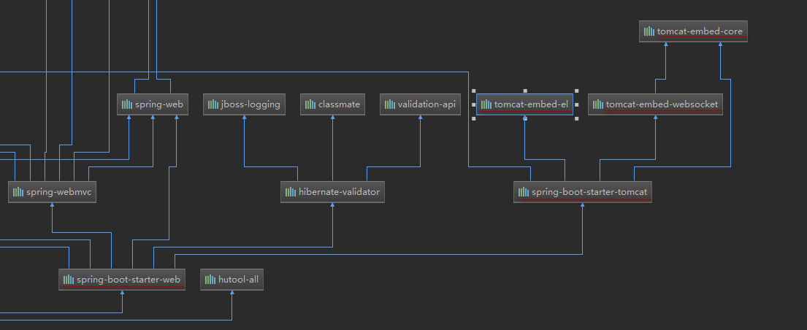
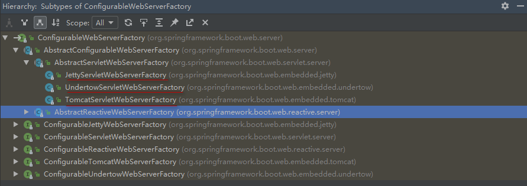
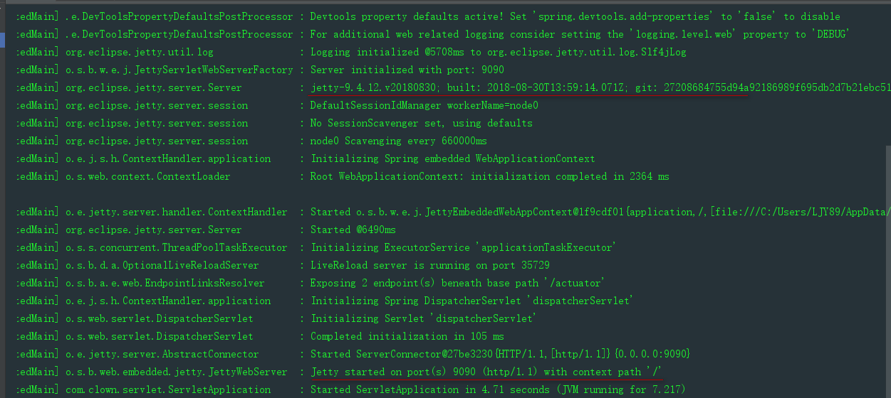
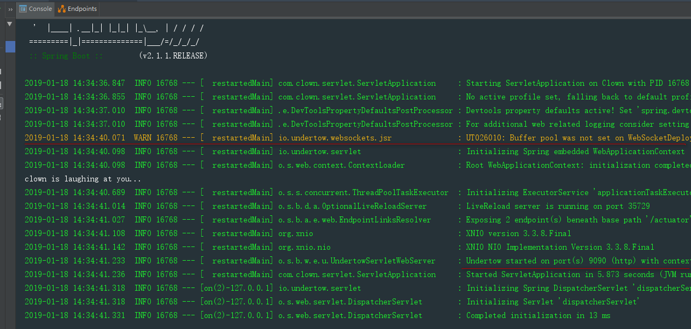

# ***SpringBoot配置嵌入式Servlet***
# ***如何修改SpringBoot的默认配置***
* SpringBoot在自动配置很多组件的时候,先看容器中有没有用户自己配置的组件
   * 如果有就用用户配置的
   * 如果没有才自动配置
   * 如果有些组件有多个,那么用户配置和默认的组合使用
* 在SpringBoot中有非常多的XXXConfigurer帮助我们进行扩展配置
* 在SpringBoot中会有很多的XXX的Customizer帮助我们进行定制配置

### **SpringBoot默认使用的是嵌入式的Servlet容器**
* 

## **1.如何定制和修改Servlet容器的相关配置**
##### **1.在配置文件中修改server有关的配置(ServerProperties)**
* ```java
  @ConfigurationProperties(prefix = "server", ignoreUnknownFields = true)
  public class ServerProperties {...}
  ```
* ```yml
  server:
    port: 9090                  #修改端口号
    tomcat:
      uri-encoding: UTF-8       #修改tomcat的编码
  ```
* 通用的Servlet容器设置
   * server.XXX
* Tomcat的设置
   * server.tomcat.XXX
##### **2.编写一个嵌入式的servlet容器定制器[WebServerFactoryCustomizer]**
* ```java
  /**
   * @author: Richard·Ackerman
   * @create: 2019/1/18
   **/
  @Configuration
  public class MyServerConfig {

      @Bean
      public WebServerFactoryCustomizer<ConfigurableWebServerFactory> factoryCustomizer(){
          return new WebServerFactoryCustomizer<ConfigurableWebServerFactory>() {

              //定制嵌入式的servlet容器相关的规则
              @Override
              public void customize(ConfigurableWebServerFactory factory) {
                  //修改端口号
                  factory.setPort(9090);
              }
          };
      }
  }
  ```
##### **3.如何注册Servlet三大组件**
* 由于SpringBoot默认是以jar包的方式启动嵌入式的Servlet容器来启动SpringBoot的web应用,没有web.xml文件,注册三大组件用一下方式
   * ServletRegistrationBean
   * FilterRegistrationBean
   * ServletListenerRegistrationBean
* ```java
  @Configuration
  public class MyServletConfig {

      /**
       * 注册Servlet
       * @return
       */
      @Bean
      public ServletRegistrationBean myServlet(){
          ServletRegistrationBean<MyServlet> servlet = new ServletRegistrationBean<>(new MyServlet(), "/myServlet");
          servlet.setLoadOnStartup(1);
          return servlet;
      }

      /**
       * 注册filter
       * @return
       */
      @Bean
      public FilterRegistrationBean myFilter(){
          FilterRegistrationBean<MyFilter> filter = new FilterRegistrationBean<>();
          filter.setFilter(new MyFilter());
          filter.setUrlPatterns(Arrays.asList("/listen","/myServlet"));
          return filter;
      }

      /**
       * 注册listener
       * @return
       */
      @Bean
      public ServletListenerRegistrationBean myListener(){
          ServletListenerRegistrationBean<MyListener> listen = new ServletListenerRegistrationBean<>(new MyListener());
          return listen;
      }
  }

  ```
* SpringBoot帮我们自动配置SpringMVC的时候,自动注册了springMVC的前端控制器 DispatcherServlet
```java
@Bean(name = DEFAULT_DISPATCHER_SERVLET_REGISTRATION_BEAN_NAME)
@ConditionalOnBean(value = DispatcherServlet.class, name = DEFAULT_DISPATCHER_SERVLET_BEAN_NAME)
public DispatcherServletRegistrationBean dispatcherServletRegistration(DispatcherServlet dispatcherServlet) {
    DispatcherServletRegistrationBean registration = new DispatcherServletRegistrationBean(dispatcherServlet, this.webMvcProperties.getServlet().getPath());
    registration.setName(DEFAULT_DISPATCHER_SERVLET_BEAN_NAME);
    registration.setLoadOnStartup(this.webMvcProperties.getServlet().getLoadOnStartup());
    if (this.multipartConfig != null) {
        registration.setMultipartConfig(this.multipartConfig);
    }
    return registration;
}
```

### **2.SpringBoot支持其它的Servlet容器**
* SpringBoot默认支持以下三个servlet容器
   * Tomcat
   * Jetty
   * Undertow

     

##### **1.Tomcat**
* 默认使用
* 在spring-boot-starter-web依赖中默认引入了tomcat
```pom
<dependency>
     <artifactId>spring-boot-starter-tomcat</artifactId>
     <groupId>org.springframework.boot</groupId>
</dependency>
```

##### **2.Jetty(长链接)**
* Jetty支持长链接的应用:在线聊天
* 切换Servlet容器为Jetty
   * 将SpringBoot默认的Servlet容器spring-boot-starter-tomcat依赖排除
     ```pom
     <!-- web -->
     <dependency>
         <groupId>org.springframework.boot</groupId>
         <artifactId>spring-boot-starter-web</artifactId>
         <exclusions>
             <exclusion>
                 <artifactId>spring-boot-starter-tomcat</artifactId>
                 <groupId>org.springframework.boot</groupId>
             </exclusion>
         </exclusions>
     </dependency>
     ```
   * 引入Jetty依赖
     ```pom
     <dependency>
         <artifactId>spring-boot-starter-jetty</artifactId>
         <groupId>org.springframework.boot</groupId>
     </dependency>
     ```
   * 启动程序

     

##### **2.Undertow(不支持JSP)**
* 切换Servlet容器为Undertow
   * 将SpringBoot默认的Servlet容器spring-boot-starter-tomcat依赖排除
   * 引入Undertow依赖
     ```pom
     <dependency>
         <artifactId>spring-boot-starter-undertow</artifactId>
         <groupId>org.springframework.boot</groupId>
     </dependency>
     ```
   * 启动程序

     

### **3.SpringBoot嵌入式Servlet容器自动配置原理**
* EmbeddedWebServerFactoryCustomizerAutoConfiguration 嵌入式的Servlet容器自动配置
```java
@Configuration
@ConditionalOnWebApplication
@EnableConfigurationProperties(ServerProperties.class)
public class EmbeddedWebServerFactoryCustomizerAutoConfiguration {

	/**
	 * Nested configuration if Tomcat is being used.
	 * 如果使用的是tomcat,就使用以下配置
	 * @ConditionalOnClass({ Tomcat.class, UpgradeProtocol.class }) //判断当前应用是否有Tomcat.class,UpgradeProtocol.class
	 */
	@Configuration
	@ConditionalOnClass({ Tomcat.class, UpgradeProtocol.class })
	public static class TomcatWebServerFactoryCustomizerConfiguration {

		@Bean
		public TomcatWebServerFactoryCustomizer tomcatWebServerFactoryCustomizer(
				Environment environment, ServerProperties serverProperties) {
			return new TomcatWebServerFactoryCustomizer(environment, serverProperties);
		}

	}

	/**
	 * Nested configuration if Jetty is being used.
	 * 如果使用的是Jetty,就使用以下配置
	 */
	@Configuration
	@ConditionalOnClass({ Server.class, Loader.class, WebAppContext.class })
	public static class JettyWebServerFactoryCustomizerConfiguration {

		@Bean
		public JettyWebServerFactoryCustomizer jettyWebServerFactoryCustomizer(
				Environment environment, ServerProperties serverProperties) {
			return new JettyWebServerFactoryCustomizer(environment, serverProperties);
		}

	}

	/**
	 * Nested configuration if Undertow is being used.
	 * 如果使用的是Undertow,就使用以下配置
	 */
	@Configuration
	@ConditionalOnClass({ Undertow.class, SslClientAuthMode.class })
	public static class UndertowWebServerFactoryCustomizerConfiguration {

		@Bean
		public UndertowWebServerFactoryCustomizer undertowWebServerFactoryCustomizer(
				Environment environment, ServerProperties serverProperties) {
			return new UndertowWebServerFactoryCustomizer(environment, serverProperties);
		}

	}

	/**
	 * Nested configuration if Netty is being used.
	 * 如果使用的是Netty,就使用以下配置
	 */
	@Configuration
	@ConditionalOnClass(HttpServer.class)
	public static class NettyWebServerFactoryCustomizerConfiguration {

		@Bean
		public NettyWebServerFactoryCustomizer nettyWebServerFactoryCustomizer(
				Environment environment, ServerProperties serverProperties) {
			return new NettyWebServerFactoryCustomizer(environment, serverProperties);
		}

	}

}
```
* 嵌入式的Tomcat容器工厂
```java
@Bean
public UndertowWebServerFactoryCustomizer undertowWebServerFactoryCustomizer(
        Environment environment, ServerProperties serverProperties) {
    return new UndertowWebServerFactoryCustomizer(environment, serverProperties);
}
```

* 以下为配置tomcat的基本环境
```java
@Override
public void customize(ConfigurableTomcatWebServerFactory factory) {
    ServerProperties properties = this.serverProperties;
    ServerProperties.Tomcat tomcatProperties = properties.getTomcat();
    PropertyMapper propertyMapper = PropertyMapper.get();
    propertyMapper.from(tomcatProperties::getBasedir).whenNonNull()
            .to(factory::setBaseDirectory);
    propertyMapper.from(tomcatProperties::getBackgroundProcessorDelay).whenNonNull()
            .as(Duration::getSeconds).as(Long::intValue)
            .to(factory::setBackgroundProcessorDelay);
    customizeRemoteIpValve(factory);
    propertyMapper.from(tomcatProperties::getMaxThreads).when(this::isPositive)
            .to((maxThreads) -> customizeMaxThreads(factory,
                    tomcatProperties.getMaxThreads()));
    propertyMapper.from(tomcatProperties::getMinSpareThreads).when(this::isPositive)
            .to((minSpareThreads) -> customizeMinThreads(factory, minSpareThreads));
    propertyMapper.from(this::determineMaxHttpHeaderSize).whenNonNull()
            .asInt(DataSize::toBytes).when(this::isPositive)
            .to((maxHttpHeaderSize) -> customizeMaxHttpHeaderSize(factory,
                    maxHttpHeaderSize));
    propertyMapper.from(tomcatProperties::getMaxSwallowSize).whenNonNull()
            .asInt(DataSize::toBytes)
            .to((maxSwallowSize) -> customizeMaxSwallowSize(factory, maxSwallowSize));
    propertyMapper.from(tomcatProperties::getMaxHttpPostSize).asInt(DataSize::toBytes)
            .when((maxHttpPostSize) -> maxHttpPostSize != 0)
            .to((maxHttpPostSize) -> customizeMaxHttpPostSize(factory,
                    maxHttpPostSize));
    propertyMapper.from(tomcatProperties::getAccesslog)
            .when(ServerProperties.Tomcat.Accesslog::isEnabled)
            .to((enabled) -> customizeAccessLog(factory));
    propertyMapper.from(tomcatProperties::getUriEncoding).whenNonNull()
            .to(factory::setUriEncoding);
    propertyMapper.from(properties::getConnectionTimeout).whenNonNull()
            .to((connectionTimeout) -> customizeConnectionTimeout(factory,
                    connectionTimeout));
    propertyMapper.from(tomcatProperties::getMaxConnections).when(this::isPositive)
            .to((maxConnections) -> customizeMaxConnections(factory, maxConnections));
    propertyMapper.from(tomcatProperties::getAcceptCount).when(this::isPositive)
            .to((acceptCount) -> customizeAcceptCount(factory, acceptCount));
    customizeStaticResources(factory);
    customizeErrorReportValve(properties.getError(), factory);
}

```


### **4.SpringBoot嵌入式Servlet容器启动原理**
* SpringBoot应用启动运行run方法
* refreshContext(context) 刷新IOC容器(创建IOC容器对象并初始化容器,创建容器中的每一个组件)
* refresh(context) 刷新创建好的IOC容器
* onRefresh() web的ioc容器重写了onRefresh() 方法
* web的ioc容器会创建嵌入式的Servlet容器
```java
@Override
protected void onRefresh() {
    super.onRefresh();
    try {
        createWebServer();
    }
    catch (Throwable ex) {
        throw new ApplicationContextException("Unable to start web server", ex);
    }
}
```
* 获取到ServletWebServerFactory.class,创建tomcat
```java
protected ServletWebServerFactory getWebServerFactory() {
    // Use bean names so that we don't consider the hierarchy
    String[] beanNames = getBeanFactory()
            .getBeanNamesForType(ServletWebServerFactory.class);
    if (beanNames.length == 0) {
        throw new ApplicationContextException(
                "Unable to start ServletWebServerApplicationContext due to missing "
                        + "ServletWebServerFactory bean.");
    }
    if (beanNames.length > 1) {
        throw new ApplicationContextException(
                "Unable to start ServletWebServerApplicationContext due to multiple "
                        + "ServletWebServerFactory beans : "
                        + StringUtils.arrayToCommaDelimitedString(beanNames));
    }
    return getBeanFactory().getBean(beanNames[0], ServletWebServerFactory.class);
}

```
<font color=red size> IOC容器启动的时候创建嵌入式的servlet容器 </font>

### **5.SpringBootServlet容器**
## **嵌入式Servlet容器优缺点**
* 优点: 简单,便携
* 缺点: 默认不支持JSP,优化定制比较复杂
   * 修改ServletProperties.class
   * 自定义定制器 EmbeddedWebServerFactoryCustomizerAutoConfiguration
   * 自己编写嵌入式Servlet容器工厂
## **外置Servlet容器**
* 外面安装的Tomcat--应用是以war包的方式打包
* 步骤
   * 创建war工程,打包方式为WAR包
   * 引入依赖,将嵌入式的Tomcat指定为provided,目标环境已经存在,打包的时候不需要内嵌的Tomcat
   * 必须编写一个SpringBootServletInitializer的实现类,调用configure方法
     ```java
     public class ServletInitializer extends SpringBootServletInitializer {
        @Override
        protected SpringApplicationBuilder configure(SpringApplicationBuilder application) {
            //传入SpringBoot应用的主程序
           return application.sources(ServletApplication.class);
        }
     }
     ```
   * 生成web应用目录结构,添加webapp文件夹与web.xml文件
   * 启动程序

* 原理
   * jar包:执行SpringBoot的启动类的main方法,启动IOC容器,IOC容器在创建嵌入式的Servlet容器
   * war包:启动服务器,服务器帮我们启动SpringBoot应用,启动IOC容器
