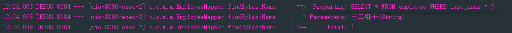

# ***SpringBoot与MyBatis整合***

## **1.引入依赖**
```pom
<dependencies>
    <!-- mybatis依赖-->
    <dependency>
        <groupId>org.mybatis.spring.boot</groupId>
        <artifactId>mybatis-spring-boot-starter</artifactId>
        <version>1.3.2</version>
    </dependency>
    <!-- 添加 druid 数据源-->
    <dependency>
        <groupId>com.alibaba</groupId>
        <artifactId>druid-spring-boot-starter</artifactId>
        <version>1.1.10</version>
    </dependency>
    <!--mysql 数据库驱动-->
    <dependency>
        <groupId>mysql</groupId>
        <artifactId>mysql-connector-java</artifactId>
        <scope>runtime</scope>
    </dependency>
</dependencies>
```

## **3.编写配置文件**
```yml
spring:
  datasource:
    driver-class-name: com.mysql.cj.jdbc.Driver
    url: jdbc:mysql://localhost:3306/springboot-mybatis?useUnicode=true&characterEncoding=utf8&serverTimezone=GMT%2B8
    username: root
    password: '123456'
    schema:
    - classpath:sql/department.sql
    - classpath:sql/employee.sql
    initialization-mode: never
    type: com.alibaba.druid.pool.DruidDataSource #切换数据源为druid
    #数据源其他配置
    initialSize: 5                             #数据库连接池初始化连接个数
    minIdle: 5
    maxActive: 20
    maxWait: 60000
    timeBetweenEvictionRunsMillis: 60000
    minEvictableIdleTimeMillis: 300000
    validationQuery: SELECT 1 FROM DUAL
    testWhileIdle: true
    testOnBorrow: false
    testOnReturn: false
    poolPreparedStatements: true
    #配置监控统计拦截的filters，去掉后监控界面sql无法统计，'wall'用于防火墙
    filters:
    - stat
    - wall
    - logback
    maxPoolPreparedStatementPerConnectionSize: 20
    useGlobalDataSourceStat: true
    connectionProperties: druid.stat.mergeSql=true;druid.stat.slowSqlMillis=500
#mybatis配置
mybatis:
  configuration:
    map-underscore-to-camel-case: true
  type-aliases-package: com.clown.mybatis.model
# config-location: classpath:mybatis/mybatis-config.xml  configuration 与 config-location 互斥
  mapper-locations: classpath:mybatis/mapper/*.xml

#logging配置
logging:
  level:
    com.clown.mybatis.mapper: debug
```

## **3.实现功能**
* Department功能[略]
* Employee 根据雇员名称查询
   * controller层写法
     ```java
     @GetMapping("/findByLastName/{lastName}")
     public Employee findByLastName(@PathVariable("lastName") String lastName){
         return employeeService.findByLastName(lastName);
     }
     ```
   * EmployeeMapper.xml
   ```xml
   <select id="findByLastName" parameterType="java.lang.String" resultType="Employee">
        SELECT * FROM employee WHERE last_name = #{lastName};
   </select>
   ```
   * 访问http://localhost:8080/employee/findByLastName/王二麻子
   * console打印的错误

     

   * 原因:
     ```java
     查资料了解到最新的tomcat6 7 8 9 都有这个问题，这个问题是由于tomcat的新版本增加了一个新特性
     就是严格按照 RFC 3986规范进行访问解析，
     而 RFC 3986规范定义了Url中只允许包含英文字母（a-zA-Z）、数字（0-9）、-_.~4个特殊字符以及所有保留字符
     (RFC3986中指定了以下字符为保留字符：! * ’ ( ) ; : @ & = + $ , / ? # [ ])。
     ```
   * 修改controller层方法为
     ```java
     @GetMapping("/findByLastName")
     public Employee findByLastName(@RequestParam("lastName") String lastName){
         return employeeService.findByLastName(lastName);
     }
     ```
   * 访问http://localhost:8080/employee/findByLastName?lastName=王二麻子 返回数据
   * console打印

     

[MyBatis官方文档](http://www.mybatis.org/mybatis-3/zh/index.html)

