# ***SpringBoot启动配置原理***

## **1.启动原理**

* **核心代码**
```java
@SuppressWarnings({ "unchecked", "rawtypes" })
public SpringApplication(ResourceLoader resourceLoader, Class<?>... primarySources) {
    this.resourceLoader = resourceLoader;

    //判断primarySources是否为空 primarySources = com.clown.starter.StarterApplication
    Assert.notNull(primarySources, "PrimarySources must not be null");
    this.primarySources = new LinkedHashSet<>(Arrays.asList(primarySources));

    //判断当前是否为一个web应用
    this.webApplicationType = WebApplicationType.deduceFromClasspath();

    //从类路径下找到META-INF/spring.factories配置的所有ApplicationContextInitializer,保存起来
    setInitializers((Collection) getSpringFactoriesInstances(
            ApplicationContextInitializer.class));

    ////从类路径下找到META-INF/spring.factories配置的所有ApplicationContextListener,保存起来[一共12个]
    setListeners((Collection) getSpringFactoriesInstances(ApplicationListener.class));

    //决定哪一个类是主程序
    this.mainApplicationClass = deduceMainApplicationClass();
}
```
* **1.创建SpringApplication对象**
* 在启动类打断点

  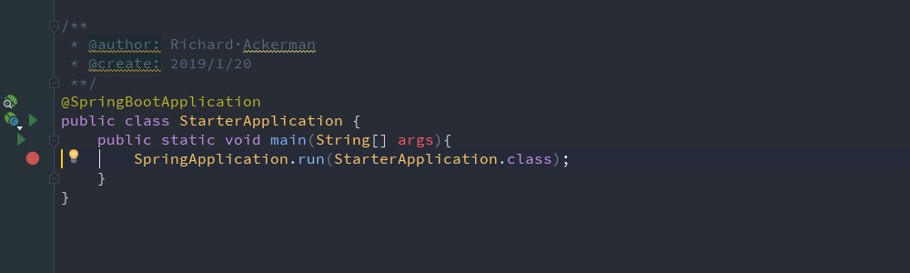
* 进入run方法

  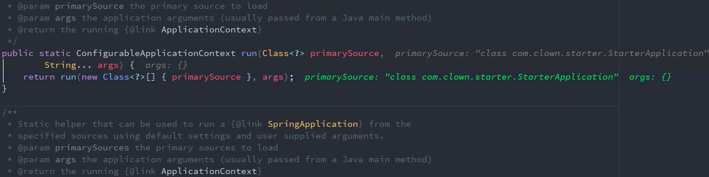
* 再进入run方法

  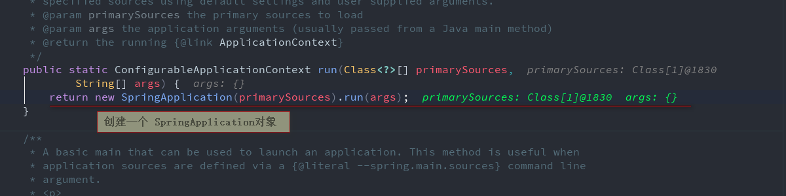
* 进入SpringApplication的run方法

  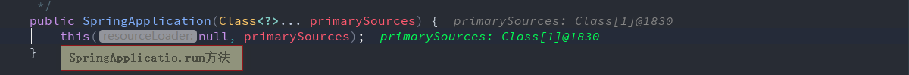
* 创建了一个SpringApplication对象

  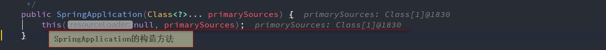
* 判断primarySources是否为null

  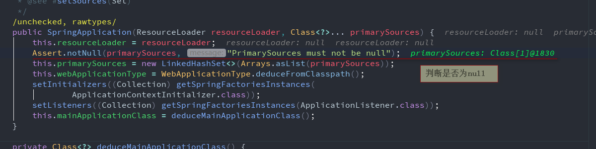

  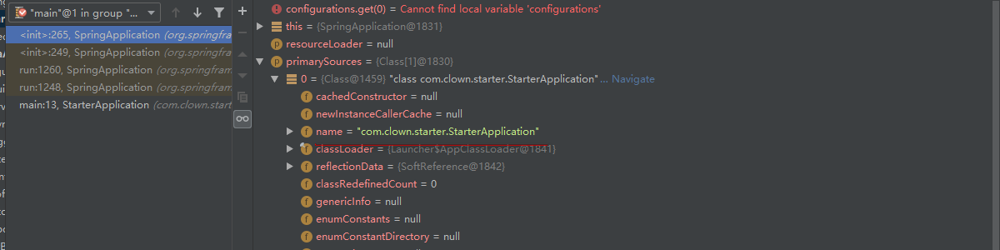

* 判断是否是一个reactive应用,如果不是,判断是否是一个servlet应用

  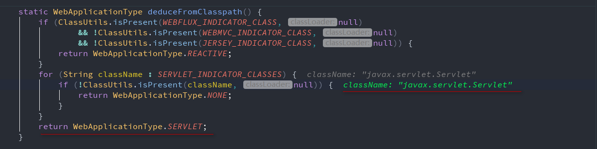
* 判断出是一个servlet应用

  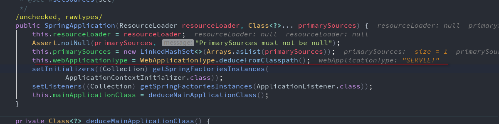
* 添加7个 initializers

  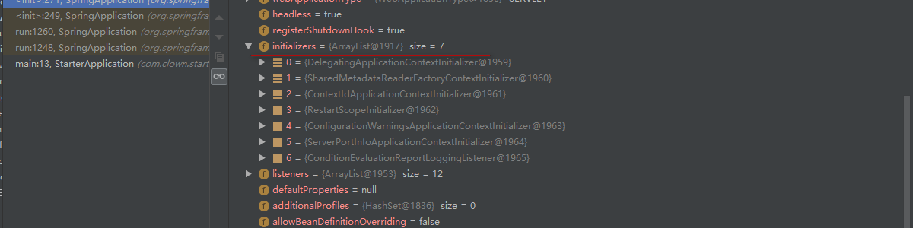
* 添加12个Listener

  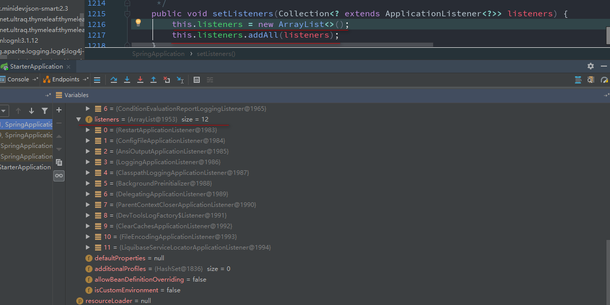
* 决定哪一个类是主程序,把所有的配置类传进来进行遍历,看哪一个配置类上有main方法

  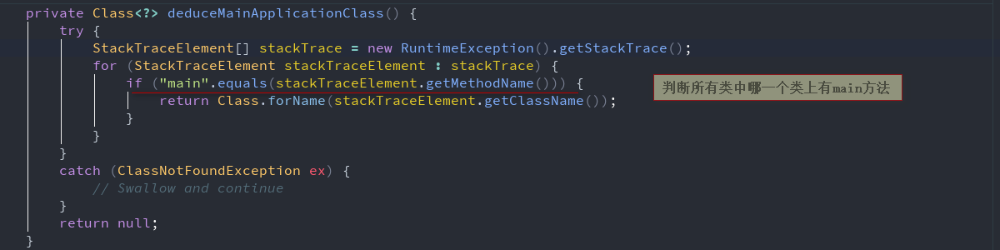
* 已经判断出哪一个是主配置类

  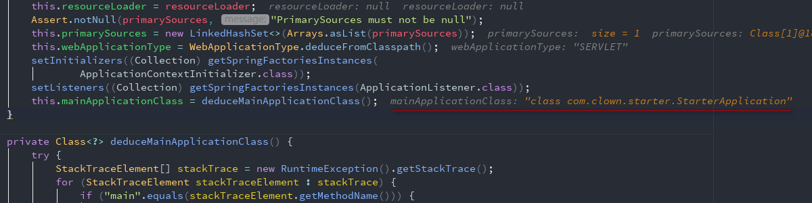
* **2.SpringApplication.run**
* 核心代码
```java
public ConfigurableApplicationContext run(String... args) {
    StopWatch stopWatch = new StopWatch();
    stopWatch.start();

    //声明一个IOC容器
    ConfigurableApplicationContext context = null;
    Collection<SpringBootExceptionReporter> exceptionReporters = new ArrayList<>();
    configureHeadlessProperty();

    //获取SpringApplicationRunListener
    SpringApplicationRunListeners listeners = getRunListeners(args);

    //回调所有SpringApplicationRunListener的starting方法 一共7个方法在SpringApplicationRunListener接口中
    listeners.starting();
    try {

        //封装命令行参数而已
        ApplicationArguments applicationArguments = new DefaultApplicationArguments(args);

        //准备环境:1.创建环境完成后回调SpringApplicationRunListener.environmentPrepared()方法,表示环境准备完成
        ConfigurableEnvironment environment = prepareEnvironment(listeners,applicationArguments);
        configureIgnoreBeanInfo(environment);

        //打印banner图
        Banner printedBanner = printBanner(environment);

        //创建IOC容器 ApplicationContext 主要决定创建web的IOC容器还是普通的IOC
        context = createApplicationContext();

        //出现异常信息报告
        exceptionReporters = getSpringFactoriesInstances(
                SpringBootExceptionReporter.class,
                new Class[] { ConfigurableApplicationContext.class }, context);

        //准备上下文环境,将environment环境保存到IOC中,而且applyInitializers(context);
        //applyInitializers 回调之前保存的所有的ApplicationContextInitializer的initialize(context)方法
        //SpringApplicationRunListener的contextPrepared(context)方法
        //prepareContext运行完成以后回调SpringApplicationRunListener的contextLoaded(context)方法
        prepareContext(context, environment, listeners, applicationArguments,printedBanner);

        //刷新容器:IOC容器初始化,加载IOC容器的所有组件,如果是WEB应用还会 创建嵌入式的Tomcat
        refreshContext(context);

        //从IOC容器中获取所有的ApplicationRunner和CommandLineRunner进行回调
        //ApplicationRunne先回调,然后再回调CommandLineRunner
        afterRefresh(context, applicationArguments);

        stopWatch.stop();
        if (this.logStartupInfo) {
            new StartupInfoLogger(this.mainApplicationClass)
                    .logStarted(getApplicationLog(), stopWatch);
        }
        listeners.started(context);
        callRunners(context, applicationArguments);
    }
    catch (Throwable ex) {
        handleRunFailure(context, ex, exceptionReporters, listeners);
        throw new IllegalStateException(ex);
    }

    try {
        listeners.running(context);
    }
    catch (Throwable ex) {
        handleRunFailure(context, ex, exceptionReporters, null);
        throw new IllegalStateException(ex);
    }

    //整个SpringBoot应用启动以后,返回IOC容器
    return context;
}
```


* 开始运行SpringApplication的run方法

  
* 停止监听,声明一个IOC容器

  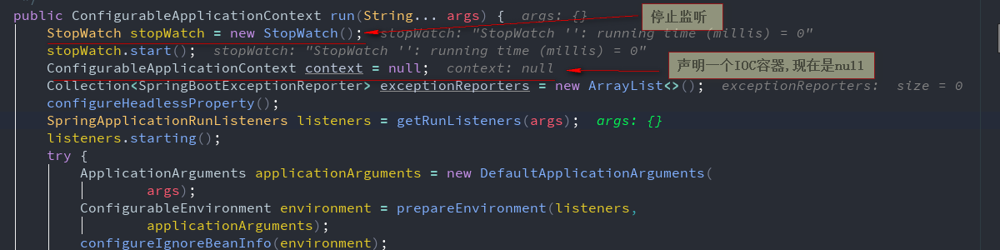
* 从类路径下META-INF/spring.factories获取SpringApplicationRunListener

  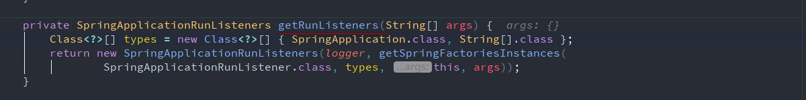
* 获取到一个Listener

  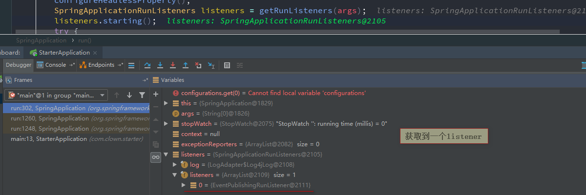
* 回调这个Listener的starting方法

  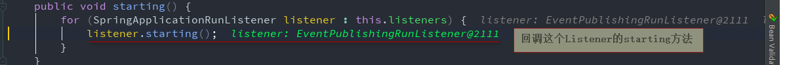
* 环境准备完成后就调用

  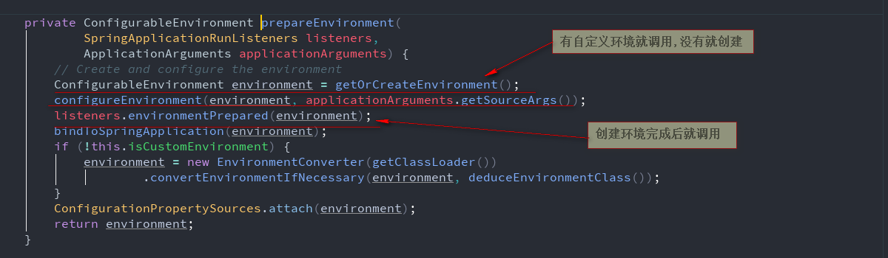
* 打印banner图

  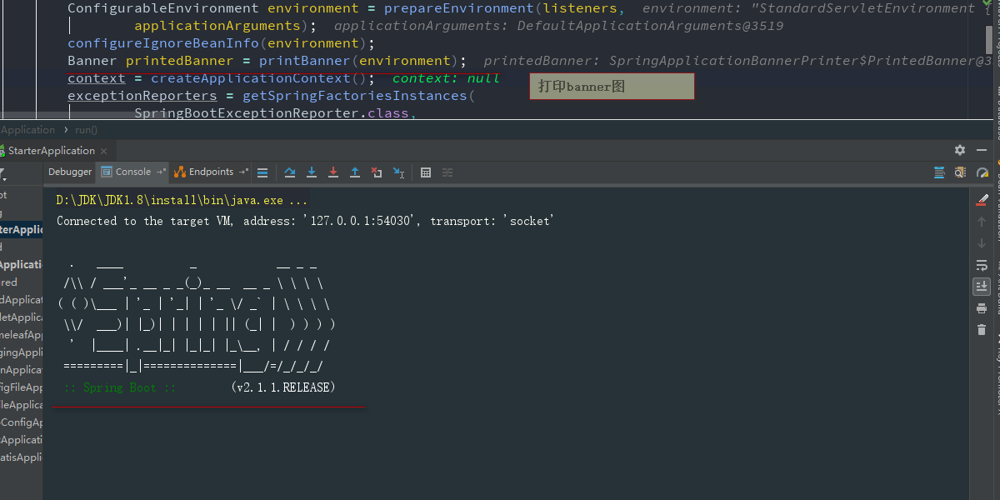
* 创建IOC容器:创建哪一种IOC容器

  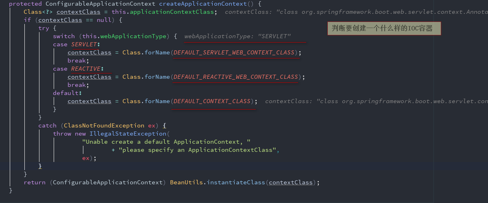
* 利用反射创建servlet IOC容器

  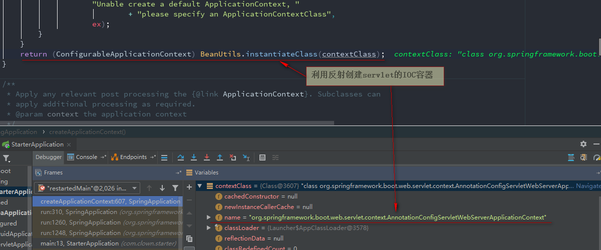
* applyInitializers(context)

  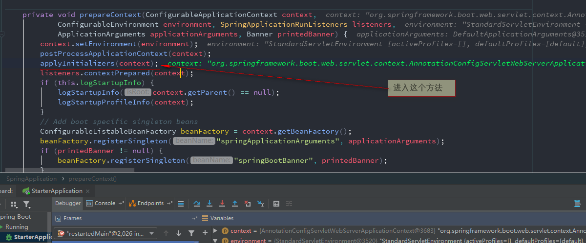
* 再次回调listeners.contextPrepared(context)方法

  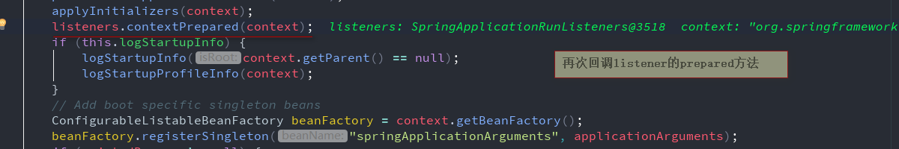
* 从IOC容器中获取所有的ApplicationRunner和CommandLineRunner进行回调

  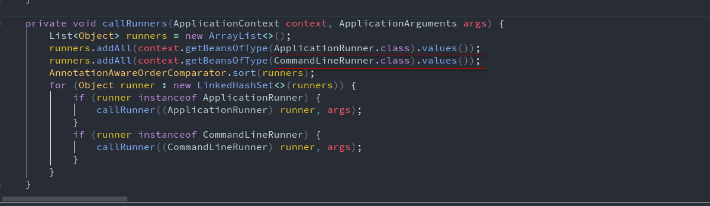


## **2.事件监听机制测试**
# **配置在META-INF/spring.factories中**
# **<font color=red>配置在META-INF/spring.factories的在类路径下创建META-INF/spring.factories文件</font>**
* ApplicationContextInitializer
   * CTRL+H 查看ApplicationContextInitializer的实现类
   * 实现ApplicationContextInitializer接口,监听IOC容器,重写ApplicationContextInitializer.initialize方法
   * ```java
     public class HelloApplicationContextInitializer implements ApplicationContextInitializer<ConfigurableApplicationContext> {
         //监听IOC容器的启动
         @Override
         public void initialize(ConfigurableApplicationContext applicationContext) {
             System.out.println("ApplicationContextInitializer...initialize" +applicationContext);
         }
     }
     ```
* SpringApplicationRunListener
   * 实现 SpringApplicationRunListener接口,重写其方法
   * ```java
     public class HelloSpringApplicationRunListener implements SpringApplicationRunListener {

         //容器正在启动
         @Override
         public void starting() {
             System.out.println("SpringApplicationRunListener...starting...容器正在启动");
         }

         //环境准备好了
         @Override
         public void environmentPrepared(ConfigurableEnvironment environment) {
             //环境信息中获取系统属性
             Object systemName = environment.getSystemEnvironment().get("os.name");
             System.out.println("SpringApplicationRunListener...environmentPrepared...环境准备好了"+systemName);
         }

         //IOC容器准备好了
         @Override
         public void contextPrepared(ConfigurableApplicationContext context) {
             System.out.println("SpringApplicationRunListener...contextPrepared...IOC容器准备好了");
         }

         //容器环境加载完成
         @Override
         public void contextLoaded(ConfigurableApplicationContext context) {
             System.out.println("SpringApplicationRunListener...contextLoaded...容器环境加载完成");
         }

         //容器已经开始运行
         @Override
         public void started(ConfigurableApplicationContext context) {
             System.out.println("SpringApplicationRunListener...started...容器已经开始运行");
         }

         //容器正在运行中
         @Override
         public void running(ConfigurableApplicationContext context) {
             System.out.println("SpringApplicationRunListener...running...容器正在运行中");
         }

         //所有都结束,容器启动
         @Override
         public void failed(ConfigurableApplicationContext context, Throwable exception) {
             System.out.println("SpringApplicationRunListener...failed...所有都结束,容器启动");
         }
     }

     ```
# **在IOC容器中的+<font color=red>@Component</font>注解**
* ApplicationRunner
   * 实现ApplicationRunner接口,重写其方法.主要是封装的一些命令行参数,打印看是什么时候调用的
   * ```java
     @Component
     public class HelloApplicationRunner implements ApplicationRunner {

         //args: 命令行参数,打印看是什么时候调用的
         @Override
         public void run(ApplicationArguments args) throws Exception {
             System.out.println("ApplicationRunner...run");
         }
     }
     ```

* CommandLineRunner
   * 实现CommandLineRunner接口,重写其方法
   * ```java
     @Component
     public class HelloCommandLineRunner implements CommandLineRunner {

         @Override
         public void run(String... args) throws Exception {
             System.out.println("CommandLineRunner...run==="+ Arrays.asList(args));
         }
     }

     ```


## **3.运行console打印**
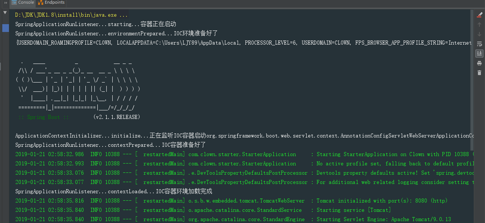

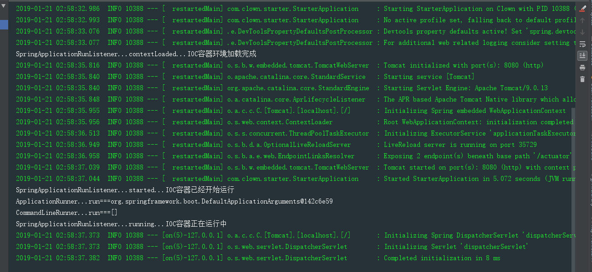