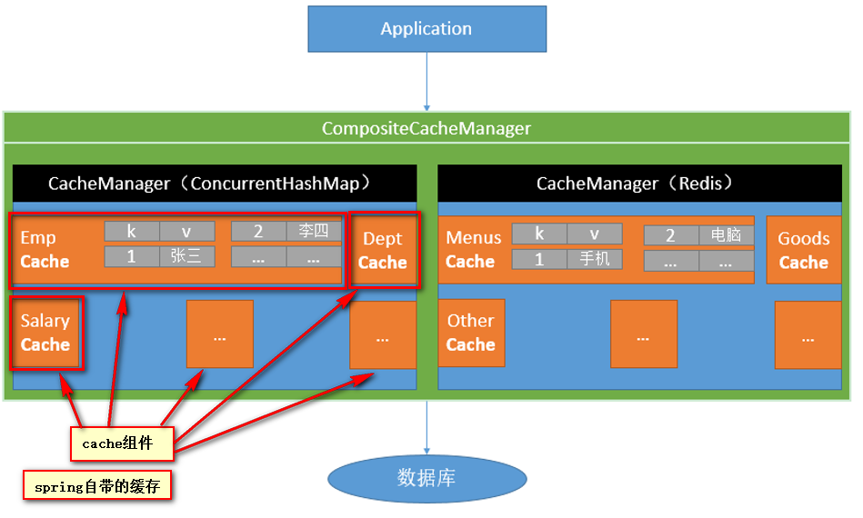
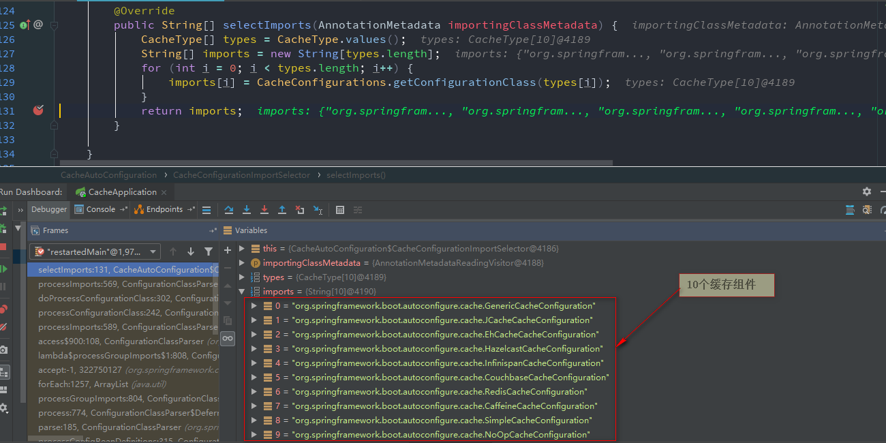
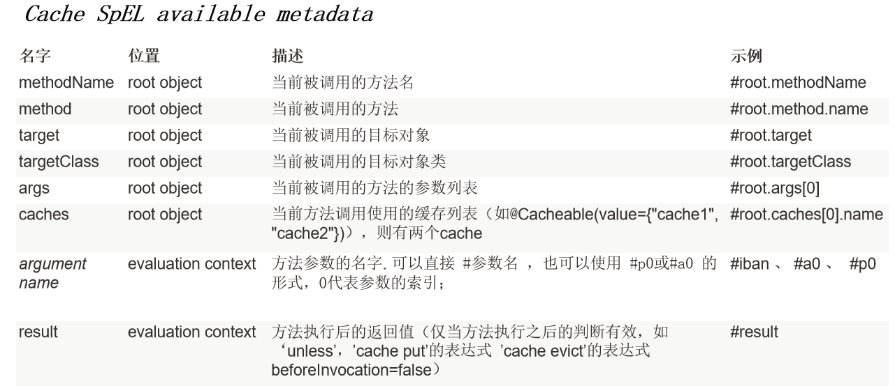

# ***SpringBoot-Cache***

**[SpringBoot官方文档](https://docs.spring.io/spring-boot/docs/2.1.2.RELEASE/reference/htmlsingle/#boot-features-caching)**

## **1.引入依赖**
```pom
<dependencies>
    <!-- 引入springboot的缓存依赖-->
    <dependency>
        <groupId>org.springframework.boot</groupId>
        <artifactId>spring-boot-starter-cache</artifactId>
    </dependency>

    <!-- mybatis依赖-->
    <dependency>
        <groupId>org.mybatis.spring.boot</groupId>
        <artifactId>mybatis-spring-boot-starter</artifactId>
        <version>1.3.1</version>
    </dependency>

    <!-- mysql驱动 -->
    <dependency>
        <groupId>mysql</groupId>
        <artifactId>mysql-connector-java</artifactId>
        <scope>runtime</scope>
    </dependency>
</dependencies>
```

## **2.开启基于注解的缓存**
```java
@EnableCaching   //开启基于注解的缓存
@MapperScan("com.clown.cache.mapper")
@SpringBootApplication
public class CacheApplication {
    public static void main(String[] args){
        SpringApplication.run(CacheApplication.class);
    }
}
```

# ***Cache***
* 缓存作用:将方法的运行结果进行缓存,当再次查询相同的数据时,直接从缓存中获取,不会再查询数据库,占用数据库资源
* 缓存原理: cacheManager创建cache组件,cache组件进行实际的CRUD操作
* cacheManager: 管理多个cache组件,对缓存的真正CRUD操作在cache组件中,每一个cache组件有自己唯一的一个名字
* cache组件: 存放不同的缓存数据

  
# ***缓存工作原理***
* <font color =red size=5>CacheAutoConfiguration</font>
  ```java
  @Configuration
  @ConditionalOnClass(CacheManager.class)
  @ConditionalOnBean(CacheAspectSupport.class)
  @ConditionalOnMissingBean(value = CacheManager.class, name = "cacheResolver")
  @EnableConfigurationProperties(CacheProperties.class)
  @AutoConfigureAfter({ CouchbaseAutoConfiguration.class, HazelcastAutoConfiguration.class,HibernateJpaAutoConfiguration.class, RedisAutoConfiguration.class })

  //给容器中导入缓存组件
  @Import(CacheConfigurationImportSelector.class)
  public class CacheAutoConfiguration {...}
  ```
* 导入的10个缓存组件

  

  * org.springframework.boot.autoconfigure.cache.GenericCacheConfiguration
  * org.springframework.boot.autoconfigure.cache.JCacheCacheConfiguration
  * org.springframework.boot.autoconfigure.cache.EhCacheCacheConfiguration
  * org.springframework.boot.autoconfigure.cache.HazelcastCacheConfiguration
  * org.springframework.boot.autoconfigure.cache.InfinispanCacheConfiguration
  * org.springframework.boot.autoconfigure.cache.CouchbaseCacheConfiguration
  * org.springframework.boot.autoconfigure.cache.RedisCacheConfiguration
  * org.springframework.boot.autoconfigure.cache.CaffeineCacheConfiguration
  * <font color = red>org.springframework.boot.autoconfigure.cache.SimpleCacheConfiguration</font>
  * org.springframework.boot.autoconfigure.cache.NoOpCacheConfiguration
  * 默认<font color = red>SimpleCacheConfiguration</font>配置类生效
* **SimpleCacheConfiguration**
```java
@Configuration
@ConditionalOnMissingBean(CacheManager.class)
@Conditional(CacheCondition.class)
class SimpleCacheConfiguration {
	private final CacheProperties cacheProperties;
	private final CacheManagerCustomizers customizerInvoker;
	SimpleCacheConfiguration(CacheProperties cacheProperties,CacheManagerCustomizers customizerInvoker) {
		this.cacheProperties = cacheProperties;
		this.customizerInvoker = customizerInvoker;
	}

    //给容器中注册了一个ConcurrentMapCacheManager
	@Bean
	public ConcurrentMapCacheManager cacheManager() {
		ConcurrentMapCacheManager cacheManager = new ConcurrentMapCacheManager();
		List<String> cacheNames = this.cacheProperties.getCacheNames();
		if (!cacheNames.isEmpty()) {
			cacheManager.setCacheNames(cacheNames);
		}
		return this.customizerInvoker.customize(cacheManager);
	}
}
```
   * 1.ConcurrentMapCacheManager调用getCache(String name)方法,根据一个组件名称名称获取组件
   * 2.如果根据名称没有获取到组件,则调用 createConcurrentMapCache(name)方法创建一个组件
   * 3.ConcurrentMapCacheManager将数据保存在ConcurrentMap中

# ***缓存运行流程***
* 第一次运行
  * 方法运行之前,先去ConcurrentMapCacheManager中查询是否有缓存组件,根据cacheName指定的名字获取
     * ConcurrentMapCacheManager.getCache(String name) 方法获取缓存
  * 创建一个以cacheName为名称的缓存组件
  * 去cache中查找一个缓存内容,使用key,key默认就是方法的参数
     * key是默认使用keyGenerator策略生成的
     * key默认使用SimpleKeyGenerator这个类中的generateKey()方法生成key
        * SimpleKeyGenerator生成key的默认策略
           * 如果没有参数,默认使用  key=new SimpleKey()
           * 如果有一个参数, key=参数值
           * 如果有多个参数, key = new SimpleKey(params)
  * 如果没有查到缓存就调用目标方法查询,并将返回的数据放入缓存中
* 第二次运行
   * 直接从缓存中查询数据

## **基于注解的缓存**


| 注解 |作用|
|---|---|
|cache|缓存接口,定义缓存操作,实现有RedisCache,EhCache,|
| cacheManager |缓存管理器,管理多个cache组件|
|@Cacheable| 主要针对方法进行配置,能够给根据方法的请求参数对其结果进行缓存|
|@CacheEvict|清空缓存|
|@CachePut|保证方法被调用,方法结果又会存储到缓存中|
|@EnableCaching|开启基于注解的缓存|
|KeyGenerator|缓存数据时Key的生成策略|
|serialize|缓存数据时value序列化策略|

## **<font color=red>@Cacheable</font>**
* 作用:先去缓存中根据key寻找数据,如果没有,调用目标方法,并将目标方法的返回值放入缓存中,如果缓存中有数据,直接返回缓存中的数据
* 运行时机:先查看缓存,缓存有数据,就不调用方法,如果没有数据,再调用方法,再添加缓存
* 属性:
   * <font color=#00FFFF size=5>value/cacheName</font>: 指定缓存组件的名字
   * <font color=#00FFFF size=5>key</font>: 缓存数据时所使用的key值
      * 默认是使用方法参数的值
      * 使用SpEL表达式 key = "#id"
         * @Cacheable(value = {"employee"},key = "#id")
         * @Cacheable(value = {"employee"},key = "#root.args[0]")
         * @Cacheable(value = {"employee"},key = "#a0")
         * @Cacheable(value = {"employee"},key = "#p0")
         * @Cacheable(value = {"employee"},key = "#root.methodName+'['+#id+']'")
         * @Cacheable(value = {"employee"},key = findById[1])
         * [注意]:@Cacheable注解不能使用key = "#result.id"
      * key的SpEL表达式写法

        
   * <font color=#00FFFF size=5>keyGenerator</font>:key的生成器,根据自己的规则如何生成缓存的key
      * @Cacheable(value = {"employee"},keyGenerator = "myKeyGenerator",condition="#id>0",unless = "#result == null")
      * <font color=red>注意: key/keyGenerator互斥 1/2</font>
   * <font color=#00FFFF size=5>cacheManager</font>: 指定使用哪一个缓存管理器
   * <font color=#00FFFF size=5>cacheResolver</font>: 指定使用哪一个缓存解析器
      * <font color=red>注意: cacheManager/cacheResolver互斥 1/2</font>
   * <font color=#00FFFF size=5>condition</font>: 指定符合条件的情况下,才将数据放入缓存中
      * @Cacheable(value = {"employee"},key = "#id",condition = "#id>1") 员工id必须大于1才能缓存,不大于1不缓存
   * <font color=#00FFFF size=5>unless</font>: 当unless指定的条件返回值为true,就不会将数据放入缓存
      * @Cacheable(value = {"employee"},condition = "#id>0",unless = "#result == null")
      * @Cacheable(value = {"employee"},key = "#id",condition="#id>1",unless = "#id==2") id==2 不缓存
   * <font color=#00FFFF size=5>sync</font>: 是否使用异步模式缓存,默认为false
      * false:查询数据的同时,将数据添加到缓存中
      * true:查询数据的同时,不将数据添加到缓存中
      * <font color=red>注意: 在异步的情况下不支持unless属性 {@link #unless()} is not supported</font>
* 完整表达式:
   * 以 employee 作为缓存组件名称,以 id 作为key,并且员工 id>0 ,返回结果不为 null ,则将这一条数据添加到缓存中
   * @Cacheable(value = {"employee"},key = "#id",condition="#id>0",unless = "#result == null")
## **<font color=red>@CachePut</font>**
* 作用:即更新了方法,又调用了缓存[多用在更新数据时]
* 解释:无论缓存中是否有数据,也执行方法,并将方法的返回值放入缓存中[方法一定会执行]
* 运行时机:先调用方法,再将方法的返回值添加到缓存中
* 属性
   * <font color=#00FFFF size=5>与@Cacheable()注解相同,用法相同</font>
   * @CachePut(value = {"employee"},key = "#employee.id")
   * @CachePut(value = {"employee"},key = "#result.id")
* <font color=red>注意:此注解签名的方法一定要有返回值,就是将返回值放入缓存</font>
## **<font color=red>@CacheEvict</font>**
* 作用: 将一条数据删除后,将缓存中的数据也删除
* 运行时机: 先运行方法,再根据key进行删除
* 属性:
   *  <font color=#00FFFF size=5>@Cacheable()注解用法相同的:</font>
      * cacheNames/value
      * key/keyGenerator
      * cacheManager
      * cacheResolver
      * condition
   *  @Cacheable()注解用法不同的:
      * <font color=#00FFFF size=5>allEntries</font>
         * 作用: 是否删除缓存中的所有数据
         * allEntries=false: 不删除全部
         * allEntries=true: 删除全部
         * @CacheEvict(value = {"employee"},allEntries = true)
      *  <font color=#00FFFF size=5>beforeInvocation</font>
         * 作用: 是否在执行方法之前删除缓存数据
         * beforeInvocation=false: 在执行完方法之后清除缓存
         * beforeInvocation=true:  在执行完方法之前清除缓存
         * @CacheEvict(value = {"employee"},allEntries = true,beforeInvocation = true)
         * 区别
            * beforeInvocation=false: 如果在执行删除方法时,执行出错,则不会清空缓存
            * beforeInvocation=true:  如果在执行删除方法时,执行出错,还是会清空缓存
## **<font color=red>@Caching</font>**
* 作用: 混合注解,定义复杂的缓存注解
* 属性:
   * <font color=#00FFFF size=5>Cacheable[] cacheable() default {};</font>
   * <font color=#00FFFF size=5>CachePut[] put() default {};</font>
   * <font color=#00FFFF size=5>CacheEvict[] evict() default {};</font>
* 写法
```java
@Caching(
        cacheable = {
                @Cacheable(value = "employee",key = "#lastName")
        },
        put = {
                @CachePut(value = "employee",key = "#result.id"),
                @CachePut(value = "employee",key = "#result.email")
        }
)
@Override
public Employee findByLastName(String lastName) {
    return employeeMapper.findByLastName(lastName);
}
```
* <font color=red>注意</font>
   ```java
   第一次将数据库查询的数据放入缓存中,cache组件名为employee,key则有三个lastName.result.id.result.email如果根据id查询的话,是从缓存查数据,
   如果根据lastName还是会执行SQL语句,因为每一次都会调用@CachePut注解的作用,所以还是会查库
   ```
## **<font color=red>@CacheConfig</font>**
* 作用: 可以对缓存的属性进行统一设置
* 位置: 类上
* 属性:
   * <font color=#00FFFF size=5>cacheNames</font>:         统一设置缓存名称
   * <font color=#00FFFF size=5>keyGenerator</font>:       统一设置缓存的key生成策略
   * <font color=#00FFFF size=5>cacheManager</font>:        统一设置缓存管理器
   * <font color=#00FFFF size=5>cacheResolver</font>:       统一设置缓存解析器
写法: @CacheConfig(cacheNames = "employee"),所有的带有value/cacheName的属性都不用写
